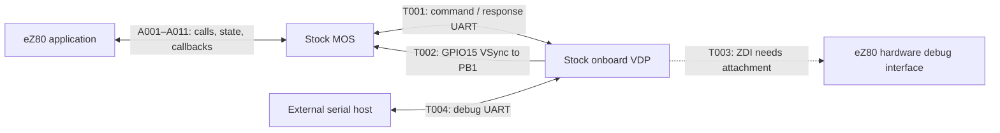

# Stock MOS/VDP communication inventory — W2

[AUDIT-004](../AUDIT-004.md), recorded 2026-09-07. **Enumeration complete for
W2; [W3 endpoint traces](communication-traces.md) now supply detailed contracts.
[W4 coverage reconciliation](coverage-review.md) is complete. The [W5 overview](README.md)
presents the inventory, accepted by the Author on 2026-09-07 within its stated limits.**
Source identities, declared configurations, and checkout rules are in the
[W1 précis](baseline-and-research-map.md): stock MOS v3.0.2, stock VDP v2.16.0,
and the pinned official-document snapshot. The working MOS fork is excluded.

The central distinction is between **a transport** and **the exchanges using
it**. The normal command stream, reverse packets, terminal mode, and several
maintenance sessions share the onboard UART. Application calls and MOS-owned
memory are software boundaries, not extra physical links.

## IDs and evidence level

1. `T001`–`T011` identify transport references, `P001`–`P025` primary processor
   exchange families, `A001`–`A011` application/operator boundaries, and
   `X001`–`X010` external-interface families. Outside this document prefix the
   ID with `AUDIT-004-`, for example `AUDIT-004-P006`. Preserve IDs when adding
   detail; do not renumber or reuse them. These are audit references, not
   hardware artifact identities, wire IDs, or construction stages.
2. Each path row identifies participants, purpose, transport dependencies,
   documentation, and source entries linked to the W3 traces. Related operations
   are grouped; this is not a replacement opcode catalogue. There are **46
   path families and 11 transport references**, not 57 separate wires.
3. The original W2 evidence level is **documented interface and/or source entry located**.
   The companion W3 traces now record detailed source behavior; this compact
   inventory retains entry references, with material routing/dependency updates.
   W2 alone did not establish sender/receiver handling, exact framing, active
   flow-control state, buffering, ordering, timing, error behavior, or lifecycle
   guarantees. W3 findings and remaining limits belong to the linked traces.
   Numerical command/packet selectors are identifiers, not timing claims.
4. For `A` rows the physical transport is **not applicable to the API call
   itself**; the dependencies column identifies downstream communication.
   Execution context is recorded in the W3 traces. For device/utility endpoints
   outside the selected source trees, peer implementation is **not yet selected**.
5. Pin declarations and connector exposure are distinct from authenticated
   wiring. [W3 board evidence](trace-hardware-and-dependencies.md) now records
   source routes for an explicit Light 2 Rev B schematic, including T002.
   Specimen wiring, electrical conditions, and measured timing remain unverified.
   No r02 circuit necessity, powered-test permission, or qualification follows.

## Transport map

Only the central shared routes are drawn below; the tables enumerate the
external interfaces. W3 verified the timing route at the selected board source.
The dashed ZDI route requires additional attachment absent from that schematic.

The ZDI endpoint is the eZ80 hardware, not a MOS command receiver. Terminal and
transfer utilities may use T001 in a different software context from the normal
MOS packet receiver; their rows below retain that distinction.

| ID | Transport / participants | Entry evidence and remaining boundary |
| --- | --- | --- |
| T001 | Onboard eZ80 UART0 ↔ VDP `Serial2`/UART2: forward bytes, reverse bytes, and flow-control lines | [D-OV], [D-SYS], [D-VAR]; [M-UART] `init_UART0`/`open_UART0`, [M-SER], [V-PROTO] `setupVDPProtocol`/`setVDPProtocolDuplex`, [V-CONFIG]. The two byte directions share one peripheral link; configured flow-control behavior is in the [primary trace](trace-primary-protocol.md). |
| T002 | VDP/display timing → eZ80 interrupt input / MOS VBLANK handler | [M-MAIN] `init_interrupts`, [M-IRQ] `_vblank_handler`, [M-INIT]; [V-CONFIG] `GPIO_ITRP` is explicitly a reference-only declaration. MOS selects `PORTB1_IVECT`; [W3 evidence](trace-hardware-and-dependencies.md) identifies GPIO15/VS to PB1 and a distinct GPIO17/ITRP to PB0 route. Do not infer the producer from the constant alone. |
| T003 | VDP ZDI controller ↔ eZ80 hardware debug interface | [V-ZDI] pin declarations and `zdi_enter`/`zdi_process_cmd`/`zdi_reset`; [V-MAIN] physical-build include and [V-PS2] `USERSPACE` stubs. Source exposes the controller; [W3 board evidence](trace-hardware-and-dependencies.md) shows no built-in GPIO26/27-to-ZDI attachment. |
| T004 | External serial host ↔ VDP debug UART0 (`DBGSerial`) | [D-VDU], [D-SYS]; [V-MAIN] `DBGSerial`/`setup`. Source declares RX GPIO3/TX GPIO1. The [W3 board trace](trace-hardware-and-dependencies.md) locates the CH340T USB-to-serial route; it is not native ESP32 USB. |
| T005 | eZ80 UART1 ↔ external serial device | [D-API] UART1 APIs; [D-GPIO]; [M-UART] `init_UART1`/`open_UART1`, [M-SER]. Port C source configuration is separate from T001; no blanket four-wire/RTS behavior claim is made. |
| T006 | eZ80 I2C master ↔ addressed external device | [D-API] I2C APIs; [M-I2C] `init_I2C` and `mos_I2C_*`, [M-IRQ] `_i2c_handler`. Device-specific protocol and physical electrical details await selection/verification. |
| T007 | eZ80 SPI/SD driver ↔ SD card | [D-MOS], [D-API]; [M-SPI] `_init_spi`/`_spi_transfer`, [M-SD], [M-DISK]. Filesystem calls are layered over this storage path, not additional wires. |
| T008 | PS/2 keyboard ↔ VDP input subsystem | [D-OV], [D-SYS]; [V-PS2] `setupKeyboardAndMouse`, `getKeyboardKey`, `setKeyboardState`. The [board/dependency trace](trace-hardware-and-dependencies.md) establishes GPIO33 clock/GPIO32 data and reached driver behavior; actual device response and signals remain unmeasured. |
| T009 | PS/2 mouse ↔ VDP input subsystem, subject to Light 2 attachment | [D-OV], [D-SYS]; [V-PS2] `enableMouse`/`disableMouse`, [V-SYS] `vdu_sys_mouse`. A Light 2 mouse adapter/attachment is not assumed present. |
| T010 | VDP/vdp-gl VGA controller → external display | [D-OV], [D-MODE]; [V-SCREEN] `getVGAController`/`updateVGAController`/`changeMode`. The [board/dependency trace](trace-hardware-and-dependencies.md) establishes selected pin defaults and schematic routes; monitor acceptance and analog/timing behavior remain unmeasured. |
| T011 | VDP/vdp-gl sound generator → board audio outputs | [D-OV], [D-AUD]; [V-AUDIO] `initAudio`/`audioDriver`. The [board/dependency trace](trace-hardware-and-dependencies.md) establishes DAC GPIO25 and the schematic audio route; actual analog/load behavior remains unverified. |

## Primary processor exchanges

For ordinary T001 operations, the eZ80 application or MOS initiates output
through MOS, and the onboard VDP owns command handling and response production.
MOS owns its ordinary UART0 packet receiver and resulting state. Explicit
alternate-software and hardware-debug cases below are exceptions to that
participant description, not supported Extender bypasses.

Packet numbers below are **type identifiers before the on-wire high-bit
marker**. They identify coverage families; the W3 traces establish selected envelopes,
payload layouts, unsolicited-versus-requested behavior, and receipt semantics.

| ID | Purpose and participants | Transport / protocol family | Entries to trace and scope notes |
| --- | --- | --- | --- |
| P001 | MOS/application → VDP text and basic display operations | T001; printable data and base VDU commands | [D-VDU], [D-OV]; [M-SER] `UART0_serial_PUTCH`; [V-STREAM] `processNext`, [V-VDU] `vdu`. Includes ordinary drawing, colour, cursor and viewport control; detailed vocabulary stays in official docs. |
| P002 | MOS/application → VDP bitmap, sprite, font and character resources | T001; `VDU 23,27`, font `&95`, character-definition families | [D-BMP], [D-FONT], [D-SYS]; [V-SPR] `vdu_sys_sprites`/`receiveBitmap`, [V-FONT] `vdu_sys_font`, [V-SYS]. Resource bytes share the command stream; buffered resource dependencies also use P004. |
| P003 | MOS/application → VDP advanced rendering state | T001; transforms, contexts, layers/tile and Copper families | [D-CTX], [D-TILE], [D-COP], [D-SYS]; [V-SYS] `vdu_sys_video`/`vdu_sys_copper`, [V-CTX] `vdu_sys_context`, [V-LAYER] `vdu_sys_layers`. Feature/configuration applicability is in the [command trace](trace-command-stream.md). |
| P004 | MOS/application → VDP buffered data, commands and execution controls | T001; `VDU 23,0,&A0` | [D-BUF]; [V-BUF] `vdu_sys_buffered`/`bufferCall`/`bufferJump`. VDP-local execution, callbacks and variable operations are grouped here; packet output effects are indexed separately by P017. |
| P005 | MOS/application → VDP rendering completion/swap requests | T001; `&C3` and `&CA` | [D-SYS]; [V-SYS] dispatch, [V-SCREEN] `waitPlotCompletion` and swap helpers. Command synchronization is distinct from the physical timing signal P024. |
| P006 | MOS startup/general poll → VDP → MOS poll result | T001; `&80`, return type `0x00` | [D-SYS] General poll; [M-MAIN] `wait_ESP32`, [M-PROTO] `vdp_protocol_GP`; [V-SYS] `wait_eZ80`/`sendGeneralPoll`. Official docs reserve this for MOS/VDP startup, not application use. The primary trace records startup and reset branches; reset timing and recovery on hardware remain unmeasured. |
| P007 | MOS/application cursor query → VDP → MOS result | T001; `&82`, type `0x02` | [D-SYS]; [V-SYS] `sendCursorPosition`; [M-PROTO] `vdp_protocol_CURSOR`. |
| P008 | MOS/application character query → VDP → MOS result | T001; `&83` or `&93`, type `0x03` | [D-SYS]; [V-SYS] `sendScreenChar`; [M-PROTO] `vpd_protocol_SCRCHAR` (source spelling). Text and graphics coordinate variants share this result family. |
| P009 | MOS/application pixel/palette query → VDP → MOS colour result | T001; `&84` or `&94`, type `0x04` | [D-SYS]; [V-SYS] `sendScreenPixel`/`sendColour`/`sendScrPixelPacket`; [M-PROTO] `vdp_protocol_POINT`. |
| P010 | MOS/application mode query or VDP mode activity → MOS mode information | T001; `&86`, type `0x06` | [D-SYS], [D-MODE]; [V-SYS] `sendModeInformation`, [V-VDU] `vdu_mode`; [M-PROTO] `vdp_protocol_MODE`. Documentation also identifies automatic mode-change notifications; selected conditions are in the [primary trace](trace-primary-protocol.md). |
| P011 | MOS/application → VDP audio control/data; VDP → MOS status | T001; `&85`, type `0x05` | [D-AUD]; [V-AUDCMD] `vdu_sys_audio`/`sendAudioStatus`; [M-PROTO] `vdp_protocol_AUDIO`. Sample data may also use P004; this is distinct from physical audio output X007. |
| P012 | MOS/application → VDP clock set/read; VDP → MOS RTC data | T001; `&87`, type `0x07` | [D-SYS], [D-API]; [V-SYS] `vdu_sys_video_time`/`sendTime`; [M-PROTO] `vdp_protocol_RTC`. No separate external RTC device is inferred. |
| P013 | MOS/application → VDP keyboard configuration; VDP → MOS settings status | T001; `&81`, `&88`, `&98`; type `0x08` | [D-SYS]; [V-SYS] `vdu_sys_video_kblayout`/`vdu_sys_keystate`/`sendKeyboardState`; [M-PROTO] `vdp_protocol_KEYSTATE`. Locale, repeat/LED and control-key behavior share this family. |
| P014 | VDP → MOS keyboard events; MOS/application may request current key state | T001; `&99` request, type `0x01` | [D-SYS], [D-KEY]; [V-STREAM] `handleKeyboardAndMouse`/`sendKeyboardData`/`processEventQueue`, [V-SYS] `VDP_CHECKKEY` case; [M-PROTO] `vdp_protocol_KEY`. Physical keys, console injection and transfer encodings retain separate origins in the W3 traces. |
| P015 | MOS/application → VDP mouse controls; VDP → MOS movement/status | T001; `&89`, type `0x09` | [D-SYS]; [V-SYS] `vdu_sys_mouse`; [V-STREAM] `sendMouseData`/`processEventQueue`; [M-PROTO] `vdp_protocol_MOUSE`. Device attachment depends on X005/T009. |
| P016 | MOS/application or VDP buffered commands → VDP configuration | T001 or VDP-local command execution; `&F8`/`&F9`, including variable `0x0101` | [D-VAR]; [M-MAIN] `wait_ESP32`; [V-VAR] `setVDPVariable`/`clearVDPVariable`; [V-PROTO] `setVDPProtocolDuplex`. Includes startup flow-control selection; the primary trace distinguishes VDP mode selection from statically asserted MOS RTS and software CTS polling. |
| P017 | VDP command processor → selected packet output destination / callbacks | T001 output, VDP buffer, or suppression; buffered command 4 and variable `0x0103` | [D-BUF], [D-SYS] VDP Protocol events; [V-BUF] `setOutputStream`/`bufferCallCallbacks`; [V-STREAM] `send_packet`. This is routing/configuration of other return families, not another physical link. |
| P018 | VDP → selected output stream: echo/spooling candidate | T001 or P017 destination; types `0x0A`/`0x0B`, flag `0x0110` | [D-VAR] reserves the flag for future MOS support; [V-CONFIG] `PACKET_ECHO`/`PACKET_ECHO_END`, [V-STREAM] `setEcho`/`flushEcho`. [M-PROTO] lists only `0x00`–`0x09` handlers. Do not infer supported stock-MOS consumption. |
| P019 | eZ80 alternate software ↔ VDP terminal emulator | T001 alternate stream mode; `VDU 23,0,&FF`; uses T008/T010 | [D-SYS] terminal mode; [V-MAIN] `startTerminal`/`processTerminal`/`stopTerminal`/`suspendTerminal`, [V-SYS] dispatch. Normal MOS packet handling is not the assumed peer; the VDP trace covers the reached terminal-library overload; external peer behavior remains unselected. |
| P020 | External sender → VDP HEX decoder → eZ80 transfer utility; utility acknowledgements → VDP | T004 and T001; `VDU 23,28` | [D-VDU] Hexload; [V-SYS] dispatch, [V-HEX] `vdu_sys_hexload`/`sendKeycodeByte`. Keyboard-formatted transfer data is not a physical key event. Utility identity not yet selected. |
| P021 | External YMODEM sender → VDP → eZ80 receiving utility, with session control | T004 and T001; `VDU 23,28,1` | [V-SYS] dispatch, [V-YMODEM] `vdu_sys_ymodem_receive`/`MOS_YmodemSession`/`sendKeycodeBytestream`. Relevant official-doc coverage not located in the bounded review; the VDP session protocol is traced; external sender and eZ80 utility implementations remain unselected. |
| P022 | eZ80 sending utility → VDP → external YMODEM receiver, with session control | T001 and T004; `VDU 23,28,2` | [V-SYS] dispatch, [V-YMODEM] `vdu_sys_ymodem_send`/`MOS_YmodemSession`/`receiveKeycodeBytestream`. Separate direction from P021, same physical links; client identity not yet selected. |
| P023 | eZ80 updater application → VDP updater → ESP32 flash/restart services | T001 maintenance; `VDU 23,0,&A1` | [D-SYS], [D-UPDATE]; [V-SYS] dispatch, [V-UPDATE] `vdu_sys_updater`/`unlock`/`receiveFirmware`/`switchFirmware`. `agon-flash` is an external application, not stock MOS itself; VDP updater handling is traced; peer implementation and deeper OTA/framework behavior remain outside the selected evidence. |
| P024 | VDP/display timing producer → eZ80 interrupt → MOS timing state | T002 VSync route | [M-MAIN] `init_interrupts`, [M-IRQ] `_vblank_handler`; [V-CONFIG] `GPIO_ITRP`, [V-SCREEN] controller entries. [W3 source trace](trace-vdp-interfaces.md) establishes the library producer and MOS consumer; board-source routing is verified, physical timing remains unmeasured. |
| P025 | External debugger → VDP ZDI controller ↔ eZ80 CPU debug/reset hardware | T004 and T003; selected auxiliary actions may use T001 | [V-ZDI] `zdi_enter`/`zdi_process_cmd`/`zdi_reset`/`ez80_serial_write`; [V-PS2] console dispatch; [V-MAIN] physical-build inclusion. MOS need not be running or receive commands. Additional debugger wiring is absent from the selected board; detailed processor debug/electrical semantics remain unverified. |

## Application and operator boundaries

These are same-eZ80 software boundaries unless a transport dependency is listed.
They identify how stock software requests work or observes results; they do
not change EMOS's ownership requirements for the Extender product.

| ID | Participants / purpose | Dependencies and entry evidence |
| --- | --- | --- |
| A001 | Application ↔ MOS API dispatch and C-function access | [D-API], [D-C]; [M-VEC] `_rst_08_handler`, [M-API] `mos_api`/`mos_api_getfunction`/`mos_function_block_start`. Common calling boundary for other rows; enumerate no separate path for every internal function. |
| A002 | Application → MOS byte/block VDU output | P001–P023 as selected; [D-API] RST 10h/18h; [M-VEC] `_rst_10_handler`/`_rst_18_handler`, [M-SER] `_putch`/`UART0_serial_PUTCH`. |
| A003 | MOS → application: binary SysVars, key map and VDP-result flags | P006–P015/P024; [D-API] System State Information, `mos_sysvars`/`mos_getkbmap`/flag APIs; [M-API] `mos_api_sysvars`/`mos_api_getkbmap`/`mos_api_clear_vdp_flags`/`mos_api_wait_vdp_flags`; [M-GLOB] `_sysvars`/`_keymap`. This is MOS-owned memory, not shared RAM with the VDP. |
| A004 | Application/CLI ↔ MOS keyboard retrieval and line editor | P014 for input, A002 for display; [D-KEY], [D-API]; [M-API] `mos_api_getkey`/`mos_api_editline`; [M-MOS] `mos_getkey`/`mos_input`. |
| A005 | Application registers keyboard callback; MOS delivers keyboard packet to it | P014; [D-API] `mos_setkbvector`; [M-API] `mos_api_setkbvector`, [M-GLOB] `_user_kbvector`, [M-PROTO]. Interrupt context is documented; calling/ordering behavior is in the [MOS trace](trace-mos-interfaces.md). |
| A006 | Application requests interrupt-vector registration; selected interrupt invokes application handler | Peripheral-dependent; [D-API] `mos_setintvector`, UART1 notes; [M-API] `mos_api_setintvector`; [M-VEC] `_set_vector`/`__vector_table`. Local callback boundary, not an extra physical link. |
| A007 | Application ↔ MOS RTC convenience API | P012 where required; [D-API] RTC read/set/unpack; [M-API] corresponding `mos_api_*`, [M-MOS] `mos_GETRTC`/`mos_SETRTC`/`mos_UNPACKRTC`. Unpacking existing data does not imply a new device exchange. |
| A008 | Operator, application or script → MOS CLI/command processing | A002/A004, storage X003, selected primary operations; [D-MOS], [D-CLI], [D-API] `mos_oscli`; [M-MOS] `mos_exec`/`mos_cmdOBEY`/`mos_cmdVDU`/`mos_cmdECHO`/`mos_cmdTIME`, [M-MAIN] `main`. |
| A009 | CLI/application ↔ MOS named variables and getter/setter callbacks | Primarily local state; selected variables invoke P012/P013/X010; [D-NVAR], [D-API]; [M-VAR] `setVarVal`/`readVarVal`; [M-MOS] `mos_setupSystemVariables`/`writeKeyboard`/`writeConsole`/`writeVDPSetting`/`readTime`/`writeTime`. Distinct from binary SysVars A003. |
| A010 | MOS → executable/moslet: launch context; application → MOS: return | Storage X003 plus whatever interfaces the program requests; [D-EXEC], [D-MOS]; [M-MOS] `mos_runBin`/`mos_runBinFile`/`mos_execMode`, [M-MISC] `_exec16`/`_exec24`/`_execSM`. Supporting application boundary; third-party application protocols are not presumed audited. |
| A011 | Application/CPU → MOS reset/crash entry; MOS ↔ operator diagnostics | A002/A004 as applicable; [D-API] RST 00h/38h, [D-MOS] Soft Boot; [M-VEC] `_reset`/`_rst0`/`__rst_38_handler`, [M-CRASH] `_on_crash`, [M-MAIN]. Software entry points are not proof of shared physical reset wiring or recovery guarantees. |

## External-interface families

Printer, console, and diagnostics share T004. Terminal, HEX, YMODEM, updater,
and ZDI are already identified by P019–P025 and are not assigned duplicate X
IDs. Device protocol implementations outside the selected firmware remain
explicit dependencies, even where stock source invokes their drivers.

| ID | Participants / purpose | Transport and source entries |
| --- | --- | --- |
| X001 | Application through MOS UART1 service ↔ external serial device | T005; [D-API] UART1, [D-GPIO]; [M-API] `mos_api_uopen`/`mos_api_uclose`/`mos_api_ugetc`/`mos_api_uputc`; [M-UART] `open_UART1`/`close_UART1`; [M-SER] `UART1_serial_GETCH`/`UART1_serial_PUTCH`/`UART1_wait_CTS`. Application owns peer protocol and any registered handler; the MOS trace records pin/peripheral configuration and CTS-only pacing; physical peer behavior remains unverified. |
| X002 | Application through MOS I2C master ↔ external addressed device | T006; [D-API] I2C; [M-I2C] `mos_I2C_OPEN`/`mos_I2C_CLOSE`/`mos_I2C_WRITE`/`mos_I2C_READ`; [M-IRQ] `_i2c_handler`. The MOS trace records waits/error branches; device-specific traffic and electrical recovery remain unverified. |
| X003 | Application/CLI through MOS/FatFS/raw-sector services ↔ SD card | T007, plus conditional P012/T001 for FatFS timestamps and pathname-variable expansion; [D-MOS] Using an SD card, [D-API] file/FatFS/low-level SD APIs; [M-MOS] `mos_FOPEN`/`mos_FREAD`/`mos_FWRITE`/`mos_LOAD`/`mos_SAVE`/`mos_mount`; [M-DISK] `disk_initialize`/`disk_read`/`disk_write`; [M-SD] `_SD_init`/`_SD_readBlocks`/`_SD_writeBlocks`, [M-SPI]. Multiple API levels share the same card transport. |
| X004 | PS/2 keyboard ↔ VDP keyboard subsystem | T008; P013/P014 carry MOS controls/events; [D-OV], [D-SYS]; [V-PS2] `setupKeyboardAndMouse`/`getKeyboardKey`/`setKeyboardLayout`/`getKeyboardState`/`setKeyboardState`. Terminal and console uses retain their separate paths. |
| X005 | PS/2 mouse ↔ VDP mouse subsystem | T009; P015 carries MOS controls/results; [D-SYS]; [V-PS2] `enableMouse`/`disableMouse`/`resetMouse`/`mouseMoved`, [V-SYS] `vdu_sys_mouse`. [W3 trace](trace-vdp-interfaces.md) verifies library defaults; added mouse attachment remains outside the selected board source. |
| X006 | VDP rendering subsystem → external VGA display | T010; primarily P001–P005; [D-MODE], [D-OV]; [V-SCREEN] `getVGAController`/`changeResolution`/`changeMode`. The VDP trace records canvas/controller effects; external display acceptance and electrical timing remain unverified. |
| X007 | VDP audio subsystem → board audio outputs | T011; P011 controls/status, P004 may provide sample resources; [D-AUD]; [V-AUDIO] `initAudio`/`audioDriver`/`setSampleRate`. Analog/device behavior unverified. |
| X008 | VDP → external serial host: debug/forced diagnostic output | T004; [V-MAIN] `debug_log`/`force_debug_log`. Conditional diagnostics are not separate physical channels; selected build/runtime conditions are in the [VDP trace](trace-vdp-interfaces.md). |
| X009 | MOS/application VDU stream → VDP printer service → external serial terminal | T001 + T004; VDU 1/2/3; [D-VDU]; [V-VDU] `vdu` printer dispatch. “Printer” names a serial forwarding service, not a newly identified printer connector. |
| X010 | External console ↔ VDP reflection/input service ↔ MOS as applicable | T004 + T001; `VDU 23,0,&FE`; [D-SYS] Console mode; [V-MAIN] `setConsoleMode`, [V-VDU] `vdu`, [V-PS2] `getKeyboardKey`. Keyboard-like input, incomplete byte reflection, and ZDI dispatch are traced in the [VDP record](trace-vdp-interfaces.md). |

## Enumeration checks and limits

1. The documented return-type list `0x00`–`0x09` is represented by P006,
   P014, P007, P008, P009, P011, P010, P012, P013, and P015 respectively.
   The source-declared echo types `0x0A`/`0x0B` are retained separately as P018
   with their stock-peer limitation. This is declaration coverage, not proof
   that every response is generated, received, or correctly handled.
2. Rendering, binary resource upload, local buffered execution, routing controls,
   queries, unsolicited input, and alternate stream sessions are all visible
   in the primary table. Source-entry discovery does not close opcode or
   configuration coverage; the W4 coverage review records that reconciliation and its limits.
3. The selected docs describe MOS modules and unified file-like peripheral
   streams as future work. They are not listed as implemented stock paths.
   Generic GPIO exposure does not establish a stock parallel-port or joystick
   protocol. A VDP `WiFi.h` include alone does not establish active networking.
4. Host flashing/recovery tools, ESP32 ROM download behavior, the eZ80 debug
   hardware implementation, transfer clients, and an actual `agon-flash`
   build are outside the selected application-source pair. Their integration
   boundaries are retained above; exact peer source selection and any needed
   scope decision belong to later work. No device-protocol or firmware-update
   execution is authorized by this inventory.
5. VDP-local updater restart, eZ80 ZDI reset, MOS software reset, and board
   reset/power wiring must not be collapsed into one reset signal. The first
   three have source entry points above; W3 separately records the board reset
   net without inferring measured reset behavior.
6. Potential documentation/source discrepancies found while locating entries
   are recorded in the task's evidence register, now updated with W3 source
   dispositions and W4 corrections. They are not repair instructions.

W3 supplies the linked endpoint traces, corrected by the W4 coverage review.
W5 presents the result in the [review overview](README.md). The Author accepted
the bounded audit on 2026-09-07; Extender comparison remains unstarted. No source modification,
build, or physical operation was performed; the hardware hold remains in force.

## Pinned evidence references

`D` references are official documentation; `M` and `V` are stock MOS and VDP
source. The symbols in each row are the entry points for later investigation.
Every link below resolves to the immutable W1 source identity.

[D-OV]: https://github.com/AgonPlatform/agon-docs/blob/f9806bd3cbff6ed5d1c08bef1d51fed11764b86b/docs/VDP.md
[D-TH]: https://github.com/AgonPlatform/agon-docs/blob/f9806bd3cbff6ed5d1c08bef1d51fed11764b86b/docs/Theory-of-operation.md
[D-API]: https://github.com/AgonPlatform/agon-docs/blob/f9806bd3cbff6ed5d1c08bef1d51fed11764b86b/docs/mos/API.md
[D-KEY]: https://github.com/AgonPlatform/agon-docs/blob/f9806bd3cbff6ed5d1c08bef1d51fed11764b86b/docs/mos/Keyboard.md
[D-MOS]: https://github.com/AgonPlatform/agon-docs/blob/f9806bd3cbff6ed5d1c08bef1d51fed11764b86b/docs/MOS.md
[D-CLI]: https://github.com/AgonPlatform/agon-docs/blob/f9806bd3cbff6ed5d1c08bef1d51fed11764b86b/docs/mos/Star-Commands.md
[D-NVAR]: https://github.com/AgonPlatform/agon-docs/blob/f9806bd3cbff6ed5d1c08bef1d51fed11764b86b/docs/mos/System-Variables.md
[D-C]: https://github.com/AgonPlatform/agon-docs/blob/f9806bd3cbff6ed5d1c08bef1d51fed11764b86b/docs/mos/C-Functions.md
[D-EXEC]: https://github.com/AgonPlatform/agon-docs/blob/f9806bd3cbff6ed5d1c08bef1d51fed11764b86b/docs/mos/Executables.md
[D-MOD]: https://github.com/AgonPlatform/agon-docs/blob/f9806bd3cbff6ed5d1c08bef1d51fed11764b86b/docs/mos/Modules.md
[D-GPIO]: https://github.com/AgonPlatform/agon-docs/blob/f9806bd3cbff6ed5d1c08bef1d51fed11764b86b/docs/GPIO.md
[D-UPDATE]: https://github.com/AgonPlatform/agon-docs/blob/f9806bd3cbff6ed5d1c08bef1d51fed11764b86b/docs/Updating-Firmware.md
[D-VDU]: https://github.com/AgonPlatform/agon-docs/blob/f9806bd3cbff6ed5d1c08bef1d51fed11764b86b/docs/vdp/VDU-Commands.md
[D-SYS]: https://github.com/AgonPlatform/agon-docs/blob/f9806bd3cbff6ed5d1c08bef1d51fed11764b86b/docs/vdp/System-Commands.md
[D-BUF]: https://github.com/AgonPlatform/agon-docs/blob/f9806bd3cbff6ed5d1c08bef1d51fed11764b86b/docs/vdp/Buffered-Commands-API.md
[D-VAR]: https://github.com/AgonPlatform/agon-docs/blob/f9806bd3cbff6ed5d1c08bef1d51fed11764b86b/docs/vdp/VDP-Variables.md
[D-AUD]: https://github.com/AgonPlatform/agon-docs/blob/f9806bd3cbff6ed5d1c08bef1d51fed11764b86b/docs/vdp/Enhanced-Audio-API.md
[D-BMP]: https://github.com/AgonPlatform/agon-docs/blob/f9806bd3cbff6ed5d1c08bef1d51fed11764b86b/docs/vdp/Bitmaps-API.md
[D-FONT]: https://github.com/AgonPlatform/agon-docs/blob/f9806bd3cbff6ed5d1c08bef1d51fed11764b86b/docs/vdp/Font-API.md
[D-CTX]: https://github.com/AgonPlatform/agon-docs/blob/f9806bd3cbff6ed5d1c08bef1d51fed11764b86b/docs/vdp/Context-Management-API.md
[D-COP]: https://github.com/AgonPlatform/agon-docs/blob/f9806bd3cbff6ed5d1c08bef1d51fed11764b86b/docs/vdp/Copper-API.md
[D-TILE]: https://github.com/AgonPlatform/agon-docs/blob/f9806bd3cbff6ed5d1c08bef1d51fed11764b86b/docs/vdp/Tile-Engine.md
[D-MODE]: https://github.com/AgonPlatform/agon-docs/blob/f9806bd3cbff6ed5d1c08bef1d51fed11764b86b/docs/vdp/Screen-Modes.md
[M-MAIN]: https://github.com/AgonPlatform/agon-mos/blob/8336409351ee5314e02801a7b72a4f1bb5282519/main.c
[M-UART]: https://github.com/AgonPlatform/agon-mos/blob/8336409351ee5314e02801a7b72a4f1bb5282519/src/uart.c
[M-UARTH]: https://github.com/AgonPlatform/agon-mos/blob/8336409351ee5314e02801a7b72a4f1bb5282519/src/uart.h
[M-SER]: https://github.com/AgonPlatform/agon-mos/blob/8336409351ee5314e02801a7b72a4f1bb5282519/src/serial.asm
[M-IRQ]: https://github.com/AgonPlatform/agon-mos/blob/8336409351ee5314e02801a7b72a4f1bb5282519/src/interrupts.asm
[M-PROTO]: https://github.com/AgonPlatform/agon-mos/blob/8336409351ee5314e02801a7b72a4f1bb5282519/src/vdp_protocol.asm
[M-VEC]: https://github.com/AgonPlatform/agon-mos/blob/8336409351ee5314e02801a7b72a4f1bb5282519/src_startup/vectors16.asm
[M-API]: https://github.com/AgonPlatform/agon-mos/blob/8336409351ee5314e02801a7b72a4f1bb5282519/src/mos_api.asm
[M-GLOB]: https://github.com/AgonPlatform/agon-mos/blob/8336409351ee5314e02801a7b72a4f1bb5282519/src_startup/globals.asm
[M-MOS]: https://github.com/AgonPlatform/agon-mos/blob/8336409351ee5314e02801a7b72a4f1bb5282519/src/mos.c
[M-VAR]: https://github.com/AgonPlatform/agon-mos/blob/8336409351ee5314e02801a7b72a4f1bb5282519/src/mos_sysvars.c
[M-I2C]: https://github.com/AgonPlatform/agon-mos/blob/8336409351ee5314e02801a7b72a4f1bb5282519/src/i2c.c
[M-SD]: https://github.com/AgonPlatform/agon-mos/blob/8336409351ee5314e02801a7b72a4f1bb5282519/src/sd.asm
[M-SPI]: https://github.com/AgonPlatform/agon-mos/blob/8336409351ee5314e02801a7b72a4f1bb5282519/src/spi.asm
[M-DISK]: https://github.com/AgonPlatform/agon-mos/blob/8336409351ee5314e02801a7b72a4f1bb5282519/src_fatfs/diskio.c
[M-MISC]: https://github.com/AgonPlatform/agon-mos/blob/8336409351ee5314e02801a7b72a4f1bb5282519/src/misc.asm
[M-CRASH]: https://github.com/AgonPlatform/agon-mos/blob/8336409351ee5314e02801a7b72a4f1bb5282519/src/crash.asm
[M-INIT]: https://github.com/AgonPlatform/agon-mos/blob/8336409351ee5314e02801a7b72a4f1bb5282519/src_startup/init_params_f92.asm
[V-MAIN]: https://github.com/AgonPlatform/agon-vdp/blob/c7ac293d2aa81ddfa693390549bcd909069c8fc3/video/video.ino
[V-CONFIG]: https://github.com/AgonPlatform/agon-vdp/blob/c7ac293d2aa81ddfa693390549bcd909069c8fc3/video/agon.h
[V-PROTO]: https://github.com/AgonPlatform/agon-vdp/blob/c7ac293d2aa81ddfa693390549bcd909069c8fc3/video/vdp_protocol.h
[V-STREAM]: https://github.com/AgonPlatform/agon-vdp/blob/c7ac293d2aa81ddfa693390549bcd909069c8fc3/video/vdu_stream_processor.h
[V-VDU]: https://github.com/AgonPlatform/agon-vdp/blob/c7ac293d2aa81ddfa693390549bcd909069c8fc3/video/vdu.h
[V-SYS]: https://github.com/AgonPlatform/agon-vdp/blob/c7ac293d2aa81ddfa693390549bcd909069c8fc3/video/vdu_sys.h
[V-BUF]: https://github.com/AgonPlatform/agon-vdp/blob/c7ac293d2aa81ddfa693390549bcd909069c8fc3/video/vdu_buffered.h
[V-VAR]: https://github.com/AgonPlatform/agon-vdp/blob/c7ac293d2aa81ddfa693390549bcd909069c8fc3/video/vdp_variables.h
[V-SPR]: https://github.com/AgonPlatform/agon-vdp/blob/c7ac293d2aa81ddfa693390549bcd909069c8fc3/video/vdu_sprites.h
[V-FONT]: https://github.com/AgonPlatform/agon-vdp/blob/c7ac293d2aa81ddfa693390549bcd909069c8fc3/video/vdu_fonts.h
[V-CTX]: https://github.com/AgonPlatform/agon-vdp/blob/c7ac293d2aa81ddfa693390549bcd909069c8fc3/video/vdu_context.h
[V-LAYER]: https://github.com/AgonPlatform/agon-vdp/blob/c7ac293d2aa81ddfa693390549bcd909069c8fc3/video/vdu_layers.h
[V-AUDCMD]: https://github.com/AgonPlatform/agon-vdp/blob/c7ac293d2aa81ddfa693390549bcd909069c8fc3/video/vdu_audio.h
[V-AUDIO]: https://github.com/AgonPlatform/agon-vdp/blob/c7ac293d2aa81ddfa693390549bcd909069c8fc3/video/agon_audio.h
[V-SCREEN]: https://github.com/AgonPlatform/agon-vdp/blob/c7ac293d2aa81ddfa693390549bcd909069c8fc3/video/agon_screen.h
[V-PS2]: https://github.com/AgonPlatform/agon-vdp/blob/c7ac293d2aa81ddfa693390549bcd909069c8fc3/video/agon_ps2.h
[V-HEX]: https://github.com/AgonPlatform/agon-vdp/blob/c7ac293d2aa81ddfa693390549bcd909069c8fc3/video/hexload.h
[V-YMODEM]: https://github.com/AgonPlatform/agon-vdp/blob/c7ac293d2aa81ddfa693390549bcd909069c8fc3/video/ymodem.h
[V-UPDATE]: https://github.com/AgonPlatform/agon-vdp/blob/c7ac293d2aa81ddfa693390549bcd909069c8fc3/video/updater.h
[V-ZDI]: https://github.com/AgonPlatform/agon-vdp/blob/c7ac293d2aa81ddfa693390549bcd909069c8fc3/video/zdi.h
