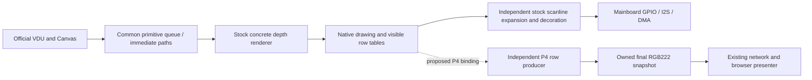

# AUDIT-006 — Stock video-backend fidelity audit

W6 source comparison completed; W7 repair proposal prepared on 2026-09-10.
Accepted by the Author with AUDIT-006-D003: no upstream bug fixes in the
first restoration pass; F009 is deferred unchanged. Source baseline is the WIP checkpoint `047ffe8`.
Firmware, games, SD media and running hardware were unchanged by this audit.

## Conclusion

The selected EDP build retains the official command/context/text/Teletext
implementation and the common Canvas/drawing algorithms. It replaces **all
five concrete depth controllers**, their native row access and optimized
operations, the palette/scanline compositor, and the independent display
execution arrangement. Those replacements exceed the differences required
by P4 peripherals or browser output.

Restore the original depth-controller family and portable scanline work,
with narrowly isolated P4 lifecycle and output bindings. Keep the browser's
existing final RGB222 protocol. Faster pixel copies alone would leave the
measured publication starvation intact; the restoration must also recover
independent display progress without adding a drawing quota.

The [proposed PORT-003 repair contract](../PORT-003/stock-backend-restoration.md)
defines the next bounded implementation increment. It first proves that the
actual stock classes can be selected with a narrow P4 binding; it does not
begin another generic renderer or a large benchmark programme.

## Evidence and limits

1. Stock VDP: v2.16.0, `c7ac293d2aa81ddfa693390549bcd909069c8fc3`.
   Selected vdp-gl: `ac2dd5986daf496c43ae8e7fe41836274aec54a0`.
   Official documentation: `f9806bd3cbff6ed5d1c08bef1d51fed11764b86b`.
   Official checkouts remained read-only. The current console source and
   selected interface hashes are bound in
   [video-source-baseline.json](video-source-baseline.json).
2. The [read-only verifier](verify-video-source.py) checked 57 selected/interface
   files against the checkpoint, all 47 official video sources/headers and
   22 relevant library files. All library files match the pinned upstream
   object. The generated application CMake list matches the console manifest;
   vendor selection is independently performed by `pio/select_sources.py`.
   File presence is not linkage: the stock concrete controllers are excluded.
3. Four source reviews form the coverage ledger below. They independently
   traced actual callers, virtual dispatch, memory access and execution owners.
   Existing phase inventories were navigation aids, not accepted proof of
   necessity or equivalence. In particular, a codec oracle duplicates the
   replacement byte order instead of establishing stock byte equality.
4. F001 is measured. Other findings below are source-proven departures or
   explicitly identified source hazards. No new performance measurements or
   physical regression tests were run. We cannot assign a percentage of the
   observed delay to a particular pixel routine or predict restored frame rate.
5. Source coverage does not establish full hardware/API qualification. Audio,
   Terminal, maintenance and deferred input features remain separately scoped;
   no assertion that all stock VDP features currently work is implied.

## Drawing and output ownership

The diagram shows the restoration target, not current EDP. Current EDP instead
uses fixed `base + y*stride` addressing and makes its frame worker drain
drawings, show software sprites, compose RGB888 and repack/publish RGB222 before
it services the next frame. The stock output interrupt continues producing
rows and advancing its frame counter while the drawing worker is busy.

Contiguous allocation can still support a row-pointer table. Browser snapshot
ownership can still be independent of native drawing storage. Neither requires
the current fixed logical row order. Drawing completion, elapsed output time,
completed snapshots, browser presentation and the mainboard PB1 clock received
by eZ80 are distinct quantities.

## Complete coverage ledger

Every supporting ledger names the exact stock/P4 files and symbols, selected
commit, reuse/difference, memory or behavior consequence, dependency evidence
and proposed disposition. Cross-cutting findings are consolidated below;
supporting row identifiers are preserved for traceability.

| Required W6 region | Source review / coverage | Result and disposition |
| --- | --- | --- |
| Mode setup/fallback, dimensions, scale, allocation lifecycle | [Facade/common review](facade-common-review.md), mode/factory/resolution rows; [storage review](storage-render-review.md) SR-03 | Retain official commands/table/fallback; restore concrete family. Narrowly bind target allocation and output timing; review changed failure/static-instance assumptions. |
| All five depths, bit/byte order, stride, row addressing, alignment | Storage ledger and SR-01–03 | Two byte layouts differ; all five lack stock row tables. Restore exact native representation and dimension/alignment invariants; record any required target access exception. |
| Clears, fills, copies, vertical/horizontal scroll, overlap and fast paths | Storage ledger, SR-02/04/08 | Stock overloads and optimized concrete bodies omitted. Restore; validate narrow-span inherited edge case rather than copying it blindly. |
| Paint modes, glyphs, text, geometry, paths, flood fill | Facade/common geometry/text/utilities rows; storage primitive rows | Common algorithms retained; substituted callbacks impose different work. Keep common bodies and restore depth accessors/bulk operations. |
| Viewport/origin clipping, ordinary and transformed bitmaps, conversions | Facade/common bitmap/viewport rows; storage SR-05/06 | Common clipping already handles one-scanline intersection. Restore direct packed conversion and distinguish framebuffer bytes, native sprite saves and RGBA2222 captures. |
| Software sprites, backgrounds, hardware sprites, text/mouse cursor | [Composition review](composition-output-review.md) CO-10–15; storage SR-06 | Common software-sprite/text-cursor bodies retained. Restore portable scanline decorator, depth save/readback and valid lifetime; isolate inherited clipping bug. |
| Palette tables, HSV selection, Copper traversal, every depth's scanline expansion | Composition CO-01–09 | Portable table/traversal/expansion replaced. Restore original table ownership and bulk row production with narrow signal-layout conversion. |
| Snapshot allocations, colour conversions, encoding/network/browser | Composition CO-16–21 | Keep justified immutable leases, protocol and consumer backpressure. Replace RGB888 intermediate and drain-dependent producer with upstream-derived packed rows. |
| Admission, draining, notifications, immediate flush, double buffering and swaps | [Frame review](frame-execution-review.md) FE-01–10 | Common queue/payload paths retained. Restore independent output and coalesced drawing wakeup; retain actual synchronous callers. No new quota. |
| Suspend/resume, task/core/ISR ownership, reconfigure lifetime | Frame FE-06/07/11/14/15 and FE-H1/H4 | Current cross-core assumptions are not proven safe. Specify actual execution owners and exclusion/lifetime before deployment; do not confuse separate atomics with an indivisible entry protocol. |
| Frame counters, waits, callbacks, text flashing and Teletext | Frame FE-04/05/09/13, FE-H2/H3; facade/common Teletext row | Retain official callback/text/Teletext code. Restore independent clock; preserve difference between queue occupancy, draw completion and presentation. |
| Physical GPIO/I2S/DMA/cache/compiler boundary | Frame FE-12/15 and composition real-seams section | Replace real peripheral/ISA bindings. Portable code within physical-driver files remains a reuse target; inert register/FP stubs are not a valid physical port. |

## Stable findings and proposed dispositions

These dispositions are accepted, with the Author's first-pass override for F009. Implementation
is owned by PORT-003; AUDIT-006 owns evidence/disposition review. QUAL-003 owns
only the subsequent measurements explicitly needed by the accepted repair.

| Finding | Evidence and practical implication | Proposed disposition / verification |
| --- | --- | --- |
| **AUDIT-006-F001 — Publication waits for a draining queue** | [Preserved measured finding](findings.md): one drain lasted 41.758495 s; no snapshot completed within its observed interior while UART traffic continued. Source: FE-03/12, CO-16. | Restore independent output progress. Verify sustained replenished drawing with independent frame/snapshot progress; finite-suite completion is insufficient. |
| **AUDIT-006-F002 — Native storage is not stock in two depths** | SR-01/03/06: 8-colour three-byte group order differs; 64-colour `x ^ 2` lane order/sync-bearing representation replaced. Other depths' within-byte packing matches but row ownership differs. | Restore native bytes and depth alignment. Compare raw rows against original stock accessors across all five depths, plus native background and public capture separately. |
| **AUDIT-006-F003 — Concrete scroll/fill/paint/bitmap paths lost** | SR-02/04/05: all five select row-pointer VScroll in stock; P4 selects another stock template overload with custom scalar row copy. Packed fills/HScroll/direct conversion replaced. | Restore actual concrete methods, overloads and row tables. Test viewport edges/overlap and normalized output against stock before timing. This finding does not claim the generic scroll template itself was invented. |
| **AUDIT-006-F004 — Palette and scanline algorithms reimplemented** | CO-01–11: P4 repeats Copper traversal/palette-ID lookup per pixel; stock resolves a table per row and uses packed expansion/decorators. | Restore palette tables, original HSV helper and row producer/decorator bodies. Validate palette/cursor/sprite order and all depth outputs. Copper cost is not a Nurples explanation: that game uses 64 colours. |
| **AUDIT-006-F005 — Unnecessary RGB888 intermediate/storage** | CO-17/18: 640×480 writes 921,600 RGB888 base bytes then compacts to 307,200 packed bytes; three maximum RGB888 slots reserve 6.75 MiB. Counts describe code work, not measured bus traffic. | Use stock-derived packed final rows at output. Keep safe leases and EVF1; size capacity for the accepted output contract, including failure/reconfigure handling. |
| **AUDIT-006-F006 — Frame execution semantics changed** | FE-04–06/13: clock advances inside combined worker; missed ticks replay complete passes; priority rises from 5 to 23 and affinity becomes unpinned. Stock ISR clock and drawing wakeups are independent. | Restore stock separation/coalescing/ownership relationships through real P4 timer/task binding. Justify any different core mapping using selected SDK tasks; test elapsed clock and callback behavior under sustained drawing. |
| **AUDIT-006-F007 — Concurrency/lifetime assumptions need repair** | FE-H1/H2/H4, CO validation limits: suspend check/start interleaving; extra immediate/double-buffer executors; mutable row/overlay source can outlive assumed ownership. These are source hazards, not identified measured hang causes. | Resolve execution entry and row/plane/palette/sprite lifetime before independent output integration. Forced interleaving and stop/swap/reconfigure tests; no full-frame draw suspension used to hide the problem. |
| **AUDIT-006-F008 — Prior fidelity evidence overstates equivalence** | SR-07, FC-01–03: codec oracle recreates changed bytes; factory change masks dropped concrete implementations; utility extractions re-express portable bodies; nominal modeline cadence differs from physical timing. | Correct active provenance/tests/contracts, preserve historical evidence with scoped labels, restore exact portable spans. Keep output timing adaptation explicit. Verify retained originals independently, not against a second copy of the replacement algorithm. |
| **AUDIT-006-F009 — Inherited stock edge defects need narrow exceptions** | SR-08 and CO-F05: narrow unaligned `swapRows` double handling, hardware sprite clipped at both edges, palette-delete-all iterator invalidation. Source-derived, not reproduced here. | Defer fixes. Preserve compilable upstream behavior unchanged in the first pass; record encountered failures without repairing upstream or rewriting the backend. |

## D002 recommendation

Prefer the **actual original concrete controller classes**, retaining their
portable method bodies, row/paint accessors and base palette/state conventions.
Bind classic peripheral lifecycle to P4 deliberately. Keep native signal-layout
bytes where that preserves exact code, normalizing lane order/sync bits only
at browser output. Where an individual body cannot remain in its original
translation unit, extract that body verbatim with a recorded dependency and
source span. Do not start by rewriting all methods into another generic class.

This is a source-backed recommendation, not a proven target build. Original
class static row aliases, word-access alignment, task/ISR assumptions and
output-source lifetime need the bounded implementation proof in the repair
contract. A host test that accepts arbitrary odd dimensions is not grounds to
discard stock width quanta. Safe stock defect remedies remain explicit.

## Historical contracts affected

1. Phase B native codecs/flat planes: superseded as a required design; retain
   historical results, replace false raw-byte oracle assumptions.
2. Phase C serialized clock/work/publication: replace with independent output
   clock and stock drawing notification behavior; no new drawing budget.
3. Phase D palette/compositor: retain observable order/readback contract,
   restore original row/table/decorator implementations.
4. Phase E single stable generic factory and nominal-label parser: reopen
   binding/lifecycle; retain official mode/command/fallback bodies.
5. Phase F RGB888 snapshot construction: retain opaque immutable consumer
   ownership and EVF1, change producer/capacity behind that boundary.

The normative direction is already in ADR-0013/ADR-0015. D002's concrete
source-binding direction is now accepted; implementation/qualification remain
with PORT-003. This does not retroactively qualify the semi-working build.
