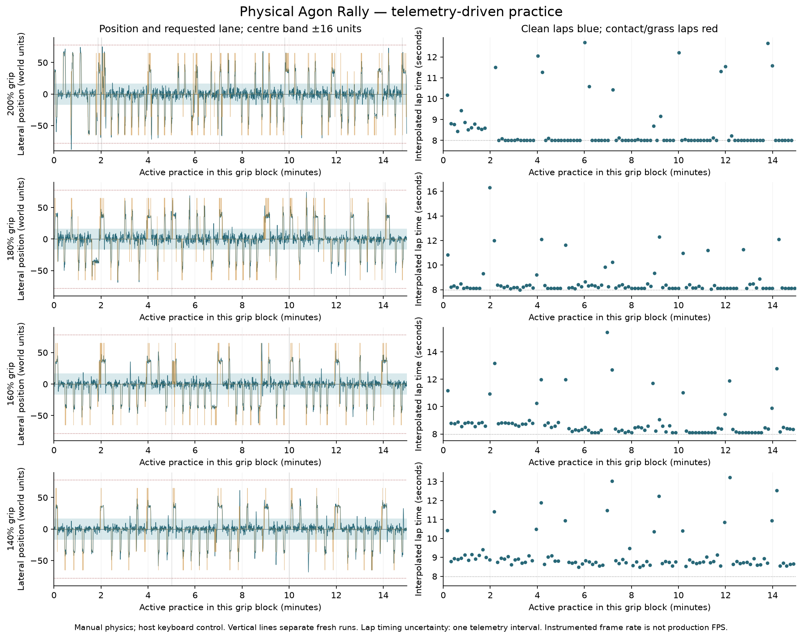

# Physical Rally driving practice,2026-09-13

The final four-block programme used3600.066seconds of recorded driving/cleanup,
excluding debugging and deployment. Earlier practice remains separately
archived. Total399completed laps,1108passes,zero physics-counted contact entries
and zero grass observations. Six kerb observations belonged to the earliest
200% run before later controller changes. Every run returned to the CLI; the
first timeout needed same-session cleanup, subsequent exits were automatic.

| Grip | Recorded seconds | Clean laps | Passes | Best lap | Median lap |
| --- | ---: | ---: | ---: | ---: | ---: |
|200% |900.090 |102 |299 |8.000s |8.000s |
|180% |900.087 |102 |293 |8.000s |8.174s |
|160% |900.061 |99 |272 |8.108s |8.455s |
|140% |899.827 |96 |244 |8.479s |8.789s |

The chart records track-relative position/target lanes and completed lap times.
Longer laps include fresh standing starts and waiting behind traffic. Data and
source/telemetry hashes are in evidence/driving-hour.json; full raw wire streams,
controller/trial source copies and keyboard journals remain in the ignored
machine-local bench archive. No opponent positions, car physics or built-in
demo assistance were manipulated during physical driving.

## One tick, then two

The Author interrupted180% practice to replace the aggressive three-tick
steering. Both new90-second runs used the same steering.bin at180% grip and
0.72corner reserve. Step1 and step2 each completed10clean laps and31passes,
with no contact/kerb/grass observations; each had14left and17right passes.
Time within±16world units of centre was76.2% versus75.5%. Best laps8.043/8.108s
differ by less than the133–167ms crossing uncertainty. One tick made424observed
wheel changes of one tick; two made370changes of two ticks. Both are viable
machine candidates; this is not a substitute for the Author's handling review.
Two remains the selected candidate default for subsequent work.

Safe progress on either side outranks centre preference. The driver first
rejects risky paths, then prefers forward progress, then uses centre distance
and lane-change cost as tie-breakers. It preserves a140world-unit nearby-car
clearance guard before crossing the passed opponent's lane. Passing side is
reported relative to that opponent; the report does not infer inside/outside
corner labels from a screenshot or steering sign.

## What changed during practice

The200% and early180% blocks included controller/HTTP refinements and the old
three-tick binary. Later180% compared one and two ticks. The160% and140% blocks
used two ticks throughout. Corner reserve increased from0.72 to0.80 at160%,
and from0.72 to0.84 at140%. At160%, the respective five-minute runs made83,93
and96passes; best laps8.505,8.108,8.108s. At140%, the runs made78,84and82passes;
best laps8.625,8.479,8.522s. All six of those lower-grip runs had no contacts,
kerb or grass observations.

Earlier informative failures and fixes are retained in EXPERIMENTS.md and the
private logs. The final two-tick driver also passed six actual-Motion local
cases at each selected lower-grip/reserve configuration, including delayed,
slow and uneven updates, a blocked road, and Fuji. Physical programme driving
was on the oval. The separate requested170% run made19passes in60seconds with
all447samples on road and no contacts; that run is outside these four blocks.

## Limits

This is controller tuning and timed practice, not a trained machine-learning
policy. The future C/Pi simulation work remains RALLY-23. Grip groups mix other
changes and are not a controlled estimate of grip alone or a human difficulty
threshold. No uncertainty-free transponder timing is claimed: lap crossings
interpolate MOS120Hz ticks between coherent telemetry samples. Surface duration
is sampled; contact entries are counted by the game every physics tick.

Median/p95 observation intervals in the later lower-grip runs are133/167ms.
Those are delivered, instrumented game observations, not physical VDP completion
or accepted production FPS. The nominal8second oval floor follows this game's
5760world-unit length and maximum speed300 with its historical integration.
The native-emulator v2 driving failure remains a failure; physical success does
not relabel it. Human visual approval of the final candidate remains separate.

Subsequent fixed qualification is recorded in HEADLESS-CLOSEOUT.md: the same
delivered two-tick game/controller passes with an explicit native UART1
TX-interrupt correction. That independently tested model is distinct from the
failed runtime above. No extra practice was added to this programme; physical
timings and the final human review boundary are unchanged.
