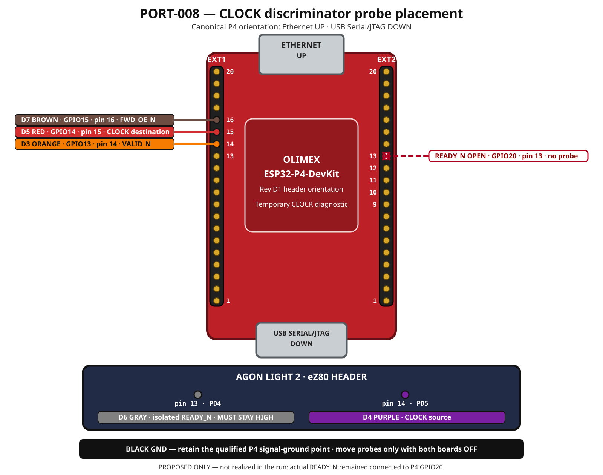

# PORT-008 CLOCK source/destination discriminator

Status: **Attempted once — temporary isolation was not established; run invalid**

Authorized identities:

1. procedure: `port-008-clock-discriminator-r01`;
2. temporary fixture: `port-008-ready-isolated-fixture-r01`; and
3. probe fixture: `la03-clock-discriminator-r01`.

This is a failed-candidate diagnostic, not a qualification procedure. It
changes no firmware, SD-card content, product wiring authority, or application
protocol. It temporarily opens one control conductor and moves three analyzer
leads while both boards are unpowered.



## Question answered

The exact installed EMOS binary contains the intended PD5/CLOCK direction and
high/low writes, but the third P4-side capture sampled no CLOCK edge. One
controlled attempt must observe the same signal simultaneously at:

1. the eZ80 source, Agon header pin 14 / `PD5`; and
2. the P4 destination, GPIO14 / EXT1 pin 15.

The attempt must prevent P4's currently proactive `READY_N` assertion from
admitting a record. That keeps EMOS in its bounded READY-admission loop, which
repeatedly toggles CLOCK and then recovers to Legacy without committing a new
VDU route.

## Controlled inputs

1. Installed EMOS image: 114,085 bytes, SHA-256
   `8f659845c24a9b328f6791a7ac75a2b820df254bc601517d1b2741ed7999987b`.
2. Installed P4 factory image: SHA-256
   `37f1dd65d76666d0fa46a05defb47544a93dc31bd9d31ef0283cf692bde2c967`.
3. Existing root `/autoexec.txt`:

   ```text
   EMOS MODE EXTENDED
   P8VDU.BIN
   ```

4. `light2-harness-r01` and the existing r01 breadboard assembly, with only the
   temporary `READY_N` opening specified below.
5. The stable LA-03 analyzer harness and qualified black signal-ground lead.
6. Active bench constraint BC-001; no keyboard interaction is required.

The operator and agent must revalidate these facts before a run rather than
inferring them from this proposal.

## Temporary electrical state

Perform every change with both boards powered off.

1. Disconnect the `READY_N` conductor at the P4 GPIO20 endpoint. Insulate or
   secure the loose contact so it cannot touch another header pin.
2. Leave the Agon-side `PD4` node and its 10-kilohm pull-up intact. This node
   must remain high when powered; otherwise the diagnostic is invalid and the
   Agon must be powered down immediately.
3. Leave common signal ground and every other r01 conductor unchanged.
4. Keep the P4-to-Agon reverse driver disabled. Do not move or add a UART wire.
5. Do not alter a resistor, rail, output-enable net, or reset connection.

The disconnected `READY_N` conductor is a temporary diagnostic fixture, not a
new harness revision or permission to operate r01 that way for another test.

## Test-local analyzer map

| Channel | Lead | Endpoint | Expected role |
|---|---|---|---|
| `D3` | orange | P4 GPIO13 / EXT1 pin 14 | `VALID_N`; remains high because no record is admitted |
| `D4` | purple | Agon header pin 14 / eZ80 `PD5` | source-side `CLOCK` |
| `D5` | red | P4 GPIO14 / EXT1 pin 15 | destination-side `CLOCK` |
| `D6` | gray | Agon-side header pin 13 / eZ80 `PD4` node | isolated sender-side `READY_N`; must remain high |
| `D7` | brown | P4 GPIO15 / EXT1 pin 16 | `FWD_OE_N`; retained context |
| `GND` | black | qualified P4 signal-ground point | common reference; do not relocate |

`D0`, `D1`, and `D2` may remain physically attached, but this diagnostic makes
no data-value claim. Moving purple `D4` and gray `D6` means the normal
`la03-p4-probe-fixture-r01` map no longer applies during this run.

## Authorized execution

1. With both boards off, the Author verifies the temporary READY opening,
   sender-side pull-up placement, probe endpoints, common ground, no rail join,
   disabled reverse path, and disconnected reset breakout.
2. Power and boot the P4 under the existing r01 controlled-power procedure.
   Require the exact visible unversioned identity, forward receiver startup,
   DHCP, and HTTP status 200. A browser WebSocket is unnecessary because this
   diagnostic expects no visible fixture execution.
3. Configure the analyzer for 24 MHz sampling, 240,000,000 samples, 10 percent
   pretrigger, and a rising-edge trigger on `D6`, the isolated eZ80-side
   `READY_N` node. This captures approximately one second before and nine
   seconds after Agon power-on. A falling-edge `D4` trigger is invalid for this
   discriminator because no source-side CLOCK is one of the required outcomes;
   stopping an untriggered `sigrok-cli` acquisition preserves no archive.
   If the analyzer cannot sustain that configuration, stop and record the
   supported rate before selecting a lower one; do not silently substitute it.
4. Arm the analyzer. Assign a fresh `PORT-008-...Z` run ID immediately before
   the Author cold-boots the Agon.
5. EMOS starts in Legacy. Autoexec explicitly requests Extended, acquires the
   prototype pins, and enters its READY-admission loop. Because sender-side
   `READY_N` is isolated and pulled high, EMOS must not enter the byte loop,
   commit the VDU route, or execute `P8VDU.BIN`.
6. The expected visible result is an autoexec line-1 failure. The prototype
   currently returns its private transport status through MOS's FatFS result
   domain: READY-admission timeout value 1 is consequently rendered as
   `Error accessing SD card`, while completion timeout value 2 is rendered as
   `Internal error`. Either is a transport failure here, not by itself an SD
   failure. This is a deliberate timeout oracle, not a passing transport
   result.
7. Preserve the raw capture, exact analyzer configuration, screen observation,
   source identities, and test-local wiring/probe map. Do not retry under the
   same run ID.
8. Power down both boards before restoring any conductor or probe. Restore the
   canonical LA-03 map and r01 `READY_N` connection only after the captured
   endpoints have been recorded.

## Interpretation

1. **Both D4 and D5 toggle with matching logical levels and edge counts:** the
   eZ80 output and r01 CLOCK conductor work; diagnosis moves to P4 PARLIO
   configuration or admission semantics.
2. **D4 toggles but D5 remains low:** the fault lies between the eZ80 PD5 pad
   and P4 GPIO14 observation point—jumper, breadboard contact, series element,
   pull-down interaction, header contact, or endpoint attachment.
3. **Neither D4 nor D5 toggles while D6 remains high:** the linked writes are
   not reaching the eZ80 PD5 pad; investigate eZ80 GPIO direction/register
   behavior and runtime execution before touching the P4 receiver.
4. **D6 goes low:** the READY isolation or probe placement is wrong. The run is
   invalid; do not interpret CLOCK behavior.
5. **D4 remains low but D5 toggles:** the probe map or common reference is
   inconsistent. The run is invalid unless an independently demonstrated
   electrical mechanism explains it.
6. **VALID_N goes low or `P8VDU.BIN` executes:** the supposedly isolated
   admission path was not isolated or EMOS did not follow the expected branch.
   Stop and classify the run invalid without proceeding to transport claims.

## Execution record

Run `PORT-008-2026-09-01-15-01-14Z` preserved 240,000,000 samples at 24 MHz.
D4 remained low for the entire capture and D5 had no post-trigger edge. The
Author subsequently clarified that the actual `READY_N` conductor remained
connected to P4 GPIO20 throughout; only analyzer probes had moved. The
temporary electrical fixture defined above was therefore not established, and
the run cannot select any discriminator branch. Its run-directory correction
preserves the authoritative interpretation without rewriting the raw capture
or contemporaneous summary.

## Stop conditions

Stop immediately on heat, odor, unexpected rail behavior, reset, wrong
identity, low sender-side READY, enabled reverse output, analyzer overrun,
unexpected route commitment, or any wiring/probe uncertainty. This diagnostic
does not authorize a firmware flash, SD-card write, mode-handshake correction,
or ordinary forward record.
