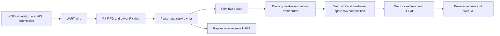

# Overnight graphics performance debrief — 2026-09-15

## Executive summary

**The P4 can execute the measured graphics work faster than mainboard VDP, but
Nurples still delivers unevenly spaced drawing completions when web output is
active. We have not demonstrated parity.** The strongest current evidence puts
most remaining timing variation **after UART arrival and before the drawing
queue**, rather than in the queued raster operation itself. Browser delivery is
a separate constraint and currently averages roughly28FPS, not60.

This report audits retained results; it does not resume experiments. The older
framebuffer-only suite, overnight streamed Nurples tests and historical Rally
emulator tests are identified separately. Positive percentages below mean P4
took **more time**: `100 × (P4 ms / mainboard ms − 1)`.

### Rendering costs: mainboard versus P4

The latest complete framebuffer-only suite has624/624 valid intervals, three
enabled repeats per case, eight unchanged probe-expectation mismatches shared
by both devices, and **zero
P4 snapshots**. Mainboard VGA was active. Selected costs below are medians;
rows are ordered by least P4 percentage saving first. They measure instrumented
execution scopes, after native-lock acquisition, not end-to-end command latency.

| Operation/work unit | Mainboard ms | P4 ms | P4 duration difference |
|---|---:|---:|---:|
| Combined viewport/scroll/clipped-plot iteration, amortized over64 |0.11055|0.04130|−62.64%|
| Clipped bitmap/viewport iteration, amortized over64 |0.10000|0.03058|−69.42%|
| BSP03_01 whole primitive batch |37.636|11.465|−69.54%|
| One-pixel downward viewport scroll, amortized over64 |0.14580|0.03288|−77.45%|
| BSP25_02 showSprites invocation, average over5 calls |4.0820|0.7276|−82.18%|

The amortized figures include the associated state/command work and the batch's
measurement marker; they are **not separately timed isolated calls**. A
showSprites call processes a set of sprites; it is not one sprite. The scroll
fixture moves a256×336 viewport downward, not sideways. There is no trustworthy
universal “one bitmap plot” or “one hardware sprite” time in these records.
Do not divide mixed primitive totals by all primitive calls and label the result
bitmap performance. [Recomputed full tables](debrief/TABLES.md) retain counts.

A contrasting example exposes the distinction: BSP22_03 native work costs
0.649ms mainboard /0.134ms P4, yet its whole resident stage takes
16.366/16.998ms (**P4 +3.86%**). Completion scheduling/transport can dominate a
fast drawing operation. Primitive and software-sprite scopes overlap; never add
them. These earlier suite figures do not measure the final r44 image under web load.

### Nurples: average rate is close; spacing is not

Current uninstrumented-parser candidate r43; same2400-refresh deterministic
workload on both targets,120 warmup boundaries,2279 measured intervals.
Rows ordered by worst P4 p95 excess. Both sprite paths have active P4 web output.

| Path | Mainboard mean ms / FPS | P4 mean ms / FPS | Mean duration difference | Mainboard p95 ms | P4 p95 ms | p95 difference |
|---|---:|---:|---:|---:|---:|---:|
| Hardware sprites |16.664 /60.008|16.659 /60.028|−0.034%|17.021|29.278|+72.01%|
| Software sprites |16.687 /59.927|16.654 /60.045|−0.197%|17.063|24.718|+44.86%|

These are **explicit sprite-refresh command completions**, not unmodified
production-game frames, physical scanouts or browser images. The frozen gate is
mean within5% of stock and p95 no more than stock+8.333ms, repeated on both paths.
The HW row fails. Earlier r40 initially passed both paths, then HW repeated at
32.989ms p95 and failed. Picking a favorable run would manufacture success.

| Same-run r43 software observation | Mean interval ms | p95 interval ms |
|---|---:|---:|
| P4 refresh enqueue |16.656|30.294|
| P4 refresh completion |16.656|29.325|
| Forward UART refresh arrival |16.657|17.381|

P4 withheld receive permission for0ms during that entire marked game window.
The80second acquisition itself stopped at68.857seconds and **failed its extent
gate**. The retained window contains both nonces and all2400 refreshes, with two
independent decoders agreeing. It is useful diagnosis, not a passing acquisition
or qualification. These p95 values are not additive latency components.

### Transport, output and other applications

| Scope | Mainboard | P4 | Meaning |
|---|---:|---:|---|
| Zero-payload UART READY/query control |0.440ms|0.681ms|P4 +54.77%; fixed setup/control cost, not raster work|
| 65,535 random bytes forward, ordinary EMOS |589.670ms|588.096ms|P4 −0.27%; qualified bulk transport|
| Largest upload-containing stage, BSP03_01 |883.707ms|866.038ms|P4 −2.00%; includes parse/create/draw/fence, not pure upload|
| Combined resident64-iteration stage |84.848ms|50.939ms|P4 −39.96%; includes more than raster work|
| r43 SW/HW browser receive, entire180s windows |Not applicable: VGA|28.16 /28.56FPS|Includes startup/terminal surface, not unique game frames|
| Earlier r24 static512×384 production snapshot |No matched VGA snapshot|11.413ms|P4 CPU output preparation, not primitive rendering|
| Same r24 complete socket-send call |No matched VGA socket|15.731ms|Acceptance by send calls, not network ACK/display|
| Current full-game Rally hardware FPS |**Not measured**|**Not measured**|Visual correctness accepted; no matched FPS result|

The previous P4 BSP03_01 value3048.353ms is superseded by the completed E09
result866.038ms. It must not be described as the current transport problem.
The suite demonstrated bulk/graphics progress with browser output disabled.
It did not establish short-command latency or streamed-game parity.

### First investigations, after reviewing all findings

1. **Measure the missing pre-enqueue time before another scheduling change.**
   On the frozen r43 parent, compare current full-stream and output-off cases
   with the same microsecond completion probe, then add only bounded diagnostic
   accounting for owner work, RX availability/read, reply-queue gating and
   unmeasured lock acquisition. The r44 native-lock probe alone is insufficient.
2. **Split snapshot work from network work if output is implicated.** Use one
   controlled isolation matrix, preserving full row work in one control and
   full-byte network output in the other. A control is not a parity candidate.
   Measure actual task/core activity before choosing one affinity adjustment.
3. **Follow the evidence into either reply/parser service or scheduler delay.**
   The P4 receives normal mode-information replies at a high command frequency;
   lwIP priority18 is unpinned above the core0 parser at3. Neither is yet a
   proven cause. Preserve stock reply semantics and the working keyboard path.
4. **Then verify correction with both sprite paths and fresh stock repeats.**
   Do not raise the drawing-opportunity divisor again on speculation. After
   Nurples timing converges, use a current non-Golem fixed-pose Rally comparison
   to cover horizontal scrolling, clipped road transforms, HUD/audio framing,
   traffic and double buffering. Existing tests do not supply that timing.

Detailed proposed gates and order are in
[the debrief action plan](DEBRIEF-PLAN.md#proposed-investigation-sequence).
These are review proposals, not experiments already authorized or started.

## 1. What was accomplished, and what remains open

1. Restored the already-qualified UART implementation on both endpoints when
   it was discovered absent from the running baseline. Fresh Nurples fenced
   SW performance rose from roughly30 to49FPS after the qualified EMOS change.
   This is measured transport/control-path progress, not an isolated P4 drawing gain.
2. Improved snapshot delivery with bounded lookahead and packed RGB222 row
   conversion, while preserving full images and bounded ownership. Static wired
   production output progressed from20.00 to24.64 to29.69FPS in those controls.
   Later measurements vary;29.69 is not a guaranteed sustained rate.
3. Found and repaired a real snapshot-transition spin-lock hazard. A higher
   priority consumer could preempt its lower-priority producer and spin on the
   producer's flag. A blocking mutex preserves exclusion and permits scheduling.
   Safety improved; the measured game rate did not automatically improve.
4. Compared output priority, core placement, row batching and framebuffer
   memory. Rejected same-core scheduling experiments that starved output or
   worsened performance. Restored stock multi-pool internal allocation with
   complete fallback, verifying actual memory selection rather than build flags.
5. Replaced intrusive per-frame query timing with matched microsecond refresh
   completion observation on both P4 and stock mainboard. This revealed near60Hz
   completion throughput but irregular P4 spacing, rather than the earlier
   apparent hard30–50FPS limit from query-fenced cases.
6. Tested more frequent P4 drawing opportunities while retaining60Hz logical
   timing. Queue latency improved, but repeated parity failed. Passive wire
   evidence narrowed remaining variation to the pre-enqueue path.
7. Removed inherited graphics and parser timing scopes from r41/r43. Neither
   removal alone solved spacing. The final r44 added only a scoped native-lock
   acquisition/RX-depth diagnostic and remains installed with its probe inactive.
8. Preserved clean local rollback points, source/assets and recovery evidence;
   restored original89byte load-only startup, exited SD service, and left neutral
   keyboard/Legacy CLI at the requested pause. No experimental work was pushed.

Open: repeatable spacing parity, unique visual delivery rate, current Rally
hardware timing, live task scheduling attribution, and human review/promotion
of the retained experimental options. A full API/scanout qualification is not
claimed from the curated graphics suite.

## 2. Evidence inventory and measurement contracts

| Evidence | What it establishes | What it does not establish |
|---|---|---|
| E09 GQT009.CSV, analysis and corpus |39cases×2routes×4passes×2phases =624 intervals;4992 metric rows;1560 ordered checkpoints; three enabled repeats|Current r43/r44 graphics costs under streaming; all API correctness|
| NP04 fresh nonce-bearing binary results |2400 matching simulation states, variant/count/save status;120warmup; peak13sprites|Drawing completion when the variant is unfenced|
| r05 matched NPTRACE |Same appended RefreshSprites per frame, balanced2400enqueue/completion records and microsecond spacing|Untouched production workload or physical scanout|
| Production browser observers |Complete messages, receipt rate, coverage, errors/gaps and retained EVF pixels|Monitor presentation or every game state shown once|
| r43 passive wire |Complete marked SW window, digital framing and byte agreement, arrival/flow-control timing|Analogue integrity, absolute cross-clock latency or a valid80second acquisition|
| r44 native trace |Parser native acquisition wall time and driver buffered bytes at enqueue|Lock hold time, all other waits, pure blocked time or causal task attribution|
| Rally road/HUD reproductions |Paired pixel behavior and accepted fixes|FPS improvement|

The strict E09 validator and independent median/count recomputation were rerun
locally for this report. Mainboard and r38–r43 raw refresh traces were independently reconstructed;
raw r44 records were reanalyzed and joined by frame index. [derive.py](debrief/derive.py) produces [derived.json](debrief/derived.json)
and [TABLES.md](debrief/TABLES.md), recording input hashes. It writes only the
debrief's derived artifacts, never changes original evidence or invokes hardware.

The full standalone graphics suite's completion time was somewhat over30minutes
by human observation. Its nominal MOS-clock conversion was27m13s and cannot
overrule wall observation. Budget about35minutes for that same prepared suite,
with a human check at30minutes, not an automatic reset. A Nurples r05 run has
about40seconds measured game work; each production browser observation lasts
180seconds including startup/terminal coverage. Deployment, recovery, result
retrieval and notification are additional costs, not rendering measurements.

## 3. Rendering, transport and output are different pipelines



On stock mainboard, physical VGA row output replaces the snapshot/socket/browser
portion. Mainboard drawing is notified by physical vertical sync; P4 drawing
uses a timer, with optional extra drawing opportunities. eZ80 pacing still has
its own VBLANK timing. Those clocks need not have a fixed phase relationship.

The graphics timer starts inside the native mutex for primitive/showSprites
scopes. Consequently fast P4 raster measurements are compatible with a delayed
parser or waiting renderer. They are wall-clock scope durations, not exclusive
CPU cycle counts. Stock and P4 CPU architectures, SDK/compiler stacks and output
work differ; these are observed device results, not a processor specification.

Hardware sprites on Agon are scanline composition, not a discrete sprite GPU.
The P4 performs that work for requested snapshot rows. With output disabled it
may do none of that work while mainboard continues VGA. That is why the old
hardware-sprite decoration totals cannot be ranked as equal-work performance.
The overnight fixture covers both sprite kinds, but RefreshSprites completion
alone cannot prove completion of all displayed hardware-sprite rows.

## 4. Detailed overnight chronology and rejected approaches

Numbers in this section retain their original boundary definitions. Do not
splice the early query-fenced FPS and later unfenced completion FPS into a
single speedup chart.

| Candidate/control | Change or observation | Recorded result | Disposition |
|---|---|---|---|
| NP01/NP03 game pilots |Unchecked create-new SAVE reused old NPRES.BIN|Repeated600-record “60FPS” results were stale|Invalidated; not success evidence|
| r24 static output |Complete drained snapshot/send accounting|Production20.00FPS; immediate-credit29.70|Valid output control only|
| r25 |Bounded snapshot lookahead|24.64 /32.67FPS respectively|Provisional output gain|
| r26 |Packed RGB222 rows|29.69 /33.45FPS; production snapshot9.163ms|Provisional; does not validate stale game pilots|
| r27 |HTTP dispatch attribution|Ready-to-send0.105/0.219ms; production23.79FPS|No evidence to rewrite HTTP queue scheduling|
| Fresh NP04/r27 |Validated unique nonces and checked result replacement|SW fenced29.57FPS vs stock58.76; unfenced33.86 vs60|First trustworthy gap of this tranche|
| r28 P4 UART alignment only |Qualified owner/Stream paths reapplied, MOS fixed|SW fenced30.01; unfenced34.03; HW30.77FPS|P4-only change insufficient|
| Qualified EMOS installed |Reapplied ordinary v0.1.17|SW49.10/HW50.72FPS fenced; no-output both60|Material endpoint progress; output implicated in that configuration|
| r29 |Snapshot priority6→2 on core1|SW51.08 then47.63; HW52.21FPS fenced|No repeatable parity|
| r30 |Row acquisition/composition diagnostic|Snapshot13.508ms: wait4.940, row work3.360, residual5.208|Output-side wall attribution, not parser delay|
| r31/r32 |Internal allocation attempt; reserve it for game mode|Boot-mode fallback; r32 first SW53.54FPS|Allocation choice alone insufficient|
| r33 |First same-core candidate|Built; not flashed because of inherited spin hazard|No timing claim|
| r34 |Replace transition spin flag with blocking mutex|SW47.58/HW50.07FPS fenced; services pass|Retain safety repair, no speed claim|
| r35 |Snapshot core0 priority2|No frames at pre-game readiness|Output starvation; no game ran|
| r36 |Snapshot core0 priority4|SW35.33/HW34.23FPS fenced|Reject for performance|
| r37 |Return output core1/priority2; two-row batches|SW49.08/HW52.33FPS fenced|No parity; unfenced control then reaches60submissionHz|
| r38 |Matched high-resolution completion traces|SW60.056/HW60.079FPS; p9530.673/31.036ms|Average is sufficient, spacing fails|
| r39 |Twice-per-frame drawing opportunities|p9525.092SW/26.692HW|HW fails; no repeats|
| r40 |Four drawing opportunities|Initial both pass; HW repeat32.989ms p95|Repeated parity fails; do not keep increasing divisor|
| r41 |Remove old graphics scopes|p9523.874SW/28.967HW|HW fails|
| r42 |Stock multi-pool internal framebuffer|Both full INTERNAL; p9529.253SW/20.978HW|SW fails|
| r43 |Remove inherited parser/frame recorder|p9524.718SW/29.278HW|HW fails; chosen behavior parent for next diagnosis|
| r44 |Native acquisition/RX-depth observation only|SW60.041FPS, p9521.821ms|Single diagnostic run, not qualification|

All r40 cases actually used PSRAM, despite requesting internal memory. r39 SW
used internal; HW fell back. Claims based on flags alone would misclassify these
experiments. r42/r43/r44 use the corrected complete-height pool path. r44 build
options remain experimental/default-off; final deployment is not evidence of
promotion into the ordinary P4 release configuration.

The row diagnostic originally failed on a cumulative old lost-completion count.
A separately documented window-local analysis required idle endpoints, unchanged
error counters, exact pixel/message units and242 complete snapshots/sends.
Its original failure remains preserved. Likewise an earlier socket accounting
window was rejected when the observer closed with a send still in flight; later
controls explicitly stopped credits and drained the final granted message.

## 5. Narrowing the current problem

### 5.1 Forward wire versus P4 processing

The r43 marked run sends1,010,740forward bytes and77,726reverse bytes over
39.976seconds. At1,152,000baud8N1, nominal forward wire occupancy is about22%.
The eZ80 deliberately paces work; idle wire time is not evidence of lost data.
P4 did not deassert receive permission in that window. Both decoders agree on
all marked-window bytes with valid framing. This strongly deprioritizes a
forward-wire/backpressure explanation for that run, without proving cables are
immune to every error or that the UART ISR never waits.

Enqueue-to-completion p95 is4.130ms in that run, while enqueue spacing p95 is
30.294ms. Queue pending peaks at1 **after enqueue**. The metric cannot see bytes
already waiting in the driver or parser. The normalized wire-to-enqueue offset
varies by81.895ms across the record; independent clocks/uncalibrated drift mean
that is not an absolute input-latency measurement.

### 5.2 Native-lock probe: useful, narrower than first phrased

r44 acquisition wall time per refresh averages0.723ms, p951.688ms, maximum
10.086ms. RX ring depth at enqueue averages17.2bytes, p95148, maximum715.
The recorded depth is a boundary sample, not a continuous high-water mark.

Rejoining the raw trace during this debrief gives:

| r44 boundary | Enqueue interval ms | Native acquisition ms | RX bytes at enqueue |
|---|---:|---:|---:|
|884|34.043|0.383|416|
|661|32.193|0.491|361|
|506|31.777|7.891|340|
|1700|31.708|1.869|416|

There are52enqueue intervals above25ms; their corresponding native acquisition
averages1.310ms. This strengthens the case for measuring outside that acquisition
region. It does **not** rule out occasional contention, cross-frame effects,
foreground locks, owner/keyboard mutexes, UART driver service or preemption.
It also does not make r44 equivalent to the worse r43 wire run: probes perturb
timing, and r44 did not reproduce the same p95 failure. No subtraction of its
mean from another run's p95 can identify a remaining CPU cost.

### 5.3 Return packets and owner service

The reverse stream consists of7772normal mode-information packets with8byte
payloads, plus one4byte terminal pixel reply. That is not per-frame diagnostic
query traffic. The current owner refills the UART FIFO, processes keyboard and
lease state, and parses batches only while its software reply queue is empty.
Stock parser commands themselves generate these replies; suppressing them would
violate the port contract.

At roughly1.94KB/s the return volume alone is far below nominal UART capacity,
but thousands of short transitions can incur scheduling/driver costs not seen
in a bulk upload. eZ80 withheld reverse receive permission for roughly921ms
cumulatively in this marked window. Whether those events line up with parser
stalls has not been established. E07P bulk parity is a prerequisite, not an
answer to this command-frequency question.

| Earlier qualified ordinary-EMOS control | Mainboard ms | P4 ms | Duration difference |
|---|---:|---:|---:|
|0payload bytes, READY/query sequence|0.440|0.681|+54.77%|
|256forward payload bytes|2.793|3.119|+11.67%|
|4096forward payload bytes|37.299|37.539|+0.64%|
|65,535random forward bytes|589.670|588.096|−0.27%|
|2048useful bytes returned in256packets|86.068|85.156|−1.06%|
|65,535forward bytes during return traffic|672.608|643.330|−4.35%|

These are the published E07P controls, not fresh r43 per-command costs. The
short controls include READY/query overhead: do not multiply their0.24–0.33ms
excess by all7772mode replies and claim that explains the Nurples delay.
The same control protocol and timing scope must be reproduced first. Evidence:
[transport comparison](../PORT-008/uart-alignment/results/e07p-transport.json),
with its hash of the owning EMOS qualification record.

### 5.4 Scheduler, memory and timer hypotheses

The candidate has parser core0/priority3, drawing core0/priority5, snapshot
core1/priority2 and an unpinned project network worker at3. SDK TCP/IP is
priority18 with no affinity; timer is22/core0. USB work also has higher priority
than the parser. These facts allow interference; they do not measure it.
There is no retained live scheduler trace identifying the culprit.

The output producer and parser/renderer share native state and memory. Moving
output to the parser core already either starved output or worsened the game.
The multi-pool internal framebuffer now works, but did not consistently improve
spacing. The remaining investigation must separate execution, ready delay,
blocking and timer phase rather than change all priorities or memory placement
at once. The [official-source audit](debrief/OFFICIAL-RESEARCH.md) records exact
source/configuration support and uncertainty.

## 6. Rally: what was actually measured

The current full game lives in AgonArcade `rally-game/`, uses eZ80 projection and
retains buffered section commands. All Golem testing remains explicitly on hold until further notice, as reconfirmed
by the Author during this audit. Golem is excluded. ExCom road reproduction
initially differed at14of80pixel samples; checked signed conversion removed all
14differences. HUD/sky corruption was traced to unconsumed audio command bytes;
muting removed the symptom, and the stock audio dispatcher with safe no-op
backend subsequently passed Author visual review. Repainting the whole HUD
would have hidden the parser bug and added unnecessary traffic.

Current matched hardware Rally FPS **has not been measured**. Mode136 road,
scroll and page probes established correctness, not timing. Default-startup
emulator acceptance and smooth Legacy play are not FPS evidence.

Useful historical non-Golem measurements remain, with strict limits:

| Historical emulator workload | Mainboard-target emulator ms | Equivalent FPS | P4 comparison |
|---|---:|---:|---|
| RALLY-18 oval lookup, computation only |14.93|67.00|None|
| RALLY-18 oval lookup, computation+commands/UART |27.01|37.03|None|
| RALLY-18 oval lookup, final-poll batch |33.98|29.43|None|
| RALLY-18 Fuji lookup, computation only |14.01|71.37|None|
| RALLY-18 Fuji lookup, computation+commands/UART |24.26|41.21|None|
| RALLY-18 Fuji lookup, final-poll batch |35.03|28.55|None|

RALLY-18 checkpoint182a1d0 used normal18.432MHz emulation,64poses and two runs
per case. Compute/UART phases used debugger cycle deltas; final-poll batch was
unpaused. These predate the final interactive/full-game changes. They are
neither physical-device times nor an EDP performance comparison. A stock general
poll is not a documented graphics fence; the historical interpretation relied
on processing order. The alleged universal30Hz emulator/double-buffer limit was
subsequently retracted pending a direct isolated test.

Earlier RALLY-10 full-road emulation was125.52/112.76ms per oval/Fuji frame on
Linux, versus127.99/114.45ms on Mac. Accelerating only emulated eZ80 with the
verified `-u` flag reached the fixture's30Hz pacing limit. Those are much older
renderer workloads, not the overnight P4 port or current Rally. No new emulator
was launched for this debrief. Cross-project evidence locations:

1. AgonArcade `docs/tasks/RALLY-18/results/README.md` and its two manifests.
2. `docs/tasks/RALLY-19/LINUX-HANDOFF.md`, especially corrected claims.
3. `docs/tasks/RALLY-10/linux-comparison/README.md` and `UNLIMITED.md`.
4. Extender [Rally findings](rally-excom/FINDINGS.md), RX06 evidence, and
   [audio-framing acceptance](../PORT-004/audio-framing/results/README.md).

## 7. Review of the investigation itself

1. **Stale output was the most serious evidence failure.** The initial fixture
   ignored SAVE failure. Many600-record pilots looked reassuring because they
   reused the same file. Those gameplay claims remain invalid. Output-only
   traces have independent provenance and were not automatically invalidated.
2. **A measurement-control check came too late.** Several snapshot scheduling
   experiments used per-frame query fencing before its effect was freshly
   isolated on the qualified endpoint. The later unfenced control exposed that
   distortion. Future corrections require current-parent probe-on/off controls
   early, not after several scheduler candidates.
3. **Missing optimization state was mistaken for baseline capability.** Qualified
   UART work had been restored away. Exact installed identities/configuration
   must be checked before blaming a component for already-fixed behavior.
4. **One favorable run is weak evidence.** r40's repeat caught a real failure.
   p95 is an interval distribution, not a measurement uncertainty estimate.
   Preserve repeated tests, max gaps and queue/receive backlog, not just FPS.
5. **Output and rendering were sometimes discussed too loosely.** Frame metadata,
   submitted work, completed refreshes, snapshots, WebGL submissions and physical
   display are distinct. A white headless screenshot came from canvas capture;
   retained EVFs and subsequent direct WebGL readback matched all512×384pixels.
6. **A real host recovery error occurred.** The updater was reset before observed
   completion. Flash contained an exact42316byte prefix and erased remainder.
   Recovery restored known-good EMOS via the maintained P4/ZDI path, then the
   qualified image was installed using observed completion. Do not classify
   that partial programming as a proven EMOS application regression. Recovery
   wiring stays intact; no firmware experiment is justified merely by its availability.
7. **Do not repeat failed branches under new names.** Same-core output priority2,
   same-core priority4, one-block internal allocation and probe-heavy timing
   already have dispositions. A new step must answer a narrower question.
8. **Some task prose is historical and contradictory if read in isolation.**
   Earlier pending/deferred or “no correction applied” sections are superseded
   by later dated acceptance. This debrief and its evidence index identify the
   current result without rewriting append-only historical runs.
9. **The wire capture failure remains a failure.** Independent decoding of its
   complete marked subset supports diagnosis; it does not validate the requested
   capture extent. Future captures must prove the actual requested duration.
10. **Coverage gaps remain explicit.** Eight old graphics-probe expectation mismatches (the same SHP23 white-versus-black
    probe on both routes over four passes, not eight P4-versus-VDP disagreements),
    BSP30 stress/scanout failures and intermittent mainboard BSP21 timeout are
    not fixed by later performance progress. Neither terminal stills nor one
    fixed13-sprite workload constitutes a complete torture-test qualification.

## 8. Deliverables, reproduction and review boundary

1. [Full recomputed tables](debrief/TABLES.md) and [hashed derived data](debrief/derived.json).
2. [Official research and source contracts](debrief/OFFICIAL-RESEARCH.md).
3. [Frozen debrief contract and proposed next sequence](DEBRIEF-PLAN.md).
4. Original evidence remains in `nurples-parity/results/`,
   `timing/results/e09-unattended/`, `rally-excom/`, and the linked AgonArcade records.

From the Extender repository root:

```sh
.venv/bin/python docs/tasks/QUAL-003/debrief/derive.py
```

This validates/recomputes existing evidence only. Do not run historical bench
controllers merely to reproduce a documentation table. No application sources,
firmware configurations, emulator profiles or official references were altered
for this debrief. Local documentation commits and the final hardware voice
receipt record delivery; hearing and approval remain the Author's decision.
The optimization goal remains unmet and its experiments remain paused.
