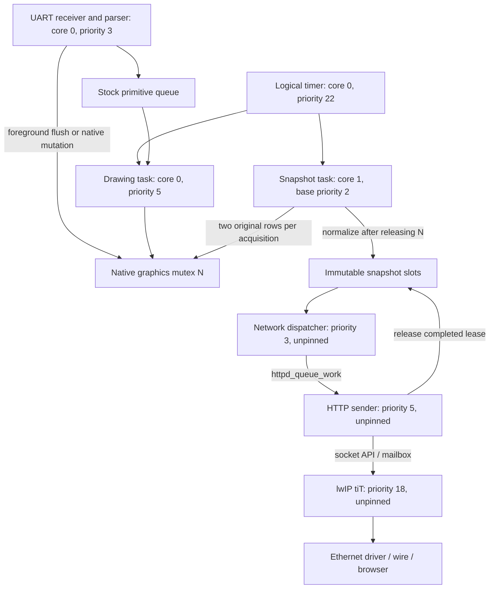

# P01f A — ownership and scheduling map

## Executive summary

The port adds a shared native-graphics mutex between parser, drawing and web
snapshot composition. Mainboard VGA64 scanout does not use that task mutex.
The immutable snapshot already separates socket sending from live graphics;
the dependency is a preemptible snapshot producer holding graphics exclusion,
not an HTTP sender deliberately retaining the framebuffer lock. No closed
deadlock cycle was established in the inspected steady-state path.

Source identities are in [SOURCES.json](SOURCES.json). Locations below use
function names as stable anchors; current checked-in diagnostic service differs
from archived r45/r48, so selected flags and archived bodies control conclusions.
This is a focused path audit, not the exhaustive AUDIT-007 review.

## Actors and handoffs

Arrows describe ownership/data flow, not locks held simultaneously. Timer
notifications coalesce; four drawing opportunities per logical frame do not
create four browser frames. The selected snapshot pool is demand driven with
one-frame lookahead. No pixel work runs in the timer callback.

| Symbol / owner | Protected state and actual nesting | Waiting and lifetime |
|---|---|---|
| F: foreground recursive mutex | `addPrimitive`, `processPrimitives`, `setSprites`, background-mode changes; may acquire N | Queue sends can block while F remains held. F does not enclose normal asynchronous drawing. |
| G: execution-gate state mutex/CV | Suspended depth and worker-active flag | Foreground holds F, waits for worker inactivity through CV; CV releases G while waiting. Worker releases G before acquiring N. |
| N: native recursive mutex | Original primitive execution, software sprites, readback, sprite fields, mutable buffers/palette and snapshot rows | Drawing holds N per operation, including nested sprite work; output holds N per two rows. A task can be preempted while owning it. |
| P: snapshot transition mutex | Free/Producer/Latest/Leased slot transitions | Producer tries once; consumer blocks. Neither holds P across composition or sending. Selected build uses a mutex, not the historical spinlock. |
| V: browser provider mutex | Current opaque lease/header/token | Acquisition may nest V → P; release moves lease out, releases V, then releases pool lease. |
| C: browser service state mutex | Client identity, credit, pending/sending state | Provider calls and lease destruction are outside C; `sendingView` releases C before transport. |
| D: dispatch mutex | Queued-send/client-takeover coordination | HTTP holds D for the full WebSocket send; dispatcher can wait for it. Neither task acquires N on this path. D → C and D → V → P are possible, with no observed reverse path to D from these callees. |
| SDK synchronization | FreeRTOS kernel locks, lwIP mailbox/semaphore, Ethernet/heap internals | Separate from N. Network tasks can preempt its owner without acquiring N. This audit does not prove every SDK/driver lock free of cycles. |

The important foreground sequence is F → suspend/wait G → execute under N →
release N → resume G → enqueue refresh. `StockBoundController` overrides the
virtual suspension methods, so reading only the base implementation would give
the wrong P4 behavior. The audited foreground flush does **not** wait for the
drawing worker while retaining N. Recursive N acquisition by `execPrimitive`
and `showSprites` is intentional nesting, not evidence of self-deadlock.

## Source index and allocation boundaries

| Source anchor | Audit conclusion |
|---|---|
| `video.ino::setup`; `transport/console_hardware.inc::runConsole` | Parser owns ordinary UART interpretation/replies; parser core0/priority3. Input processing can remain continuously runnable, explaining the previously rejected output core0/priority2 experiment. |
| `display/stock_native_access.cpp`; `stock_runtime_controller.hpp::drain/prepareRows` | Gate briefly protects admission; native exclusion is per operation/two rows, not around the whole drain/frame. |
| `vendor/vdp-gl/src/displaycontroller.cpp::addPrimitive/processPrimitives/setSprites/execPrimitive` | Port-added F and N surround retained original operations. Queue-full waits and foreground flushes are distinct from native row ownership. |
| Same file, `primitiveReplaceDynamicBuffers` | Inherited path/matrix allocation retry uses `taskYIELD()`. P4 allocator access takes N; caller keeps F. A priority-inherited parser could remain above the drawing task after releasing N until F is released. This is a reachable risk for relevant dynamic primitives, not a demonstrated cause in SW2400. |
| `display/stock_render_utils.cpp::LightMemoryPool::alloc/free`; sprite methods | Allocation/free can occur under N; `setSprites` may resize saved backgrounds. No blanket assertion that all graphics critical sections are constant-time. Timed SW2400 principally reuses loaded sprite assets; general allocation findings are not proof of its tail. |
| `sprites.h`, `context.h`, `buffer_stream.h`, `buffers.h`, `vdu_buffered.h` guarded mutations | Checked relevant field mutations, buffer writes/reverse and sprite lifecycle ordering. Important examples put UART argument reads and completion waits before N. This sampling does not certify every VDP command/lifecycle path. |
| `display/stock_scanline.cpp`; `prepareRowLocked` | Original row preparation reads framebuffer plus cursor/hardware-sprite metadata; palette revision invalidates retained Copper cursor. Removing N blindly would break lifetime protection. |
| `presentation_snapshot_pool.cpp::tryBegin/finish/tryAcquireLatest/releaseLease` | Slots preallocated; no per-frame framebuffer allocation in these hot transitions. Lookahead intentionally overlaps next composition with previous transmission. |
| `web/browser_video_provider.cpp`; `network/browser_video_service_core.cpp` | Leased pixels immutable until completion/release. Provider uses V → P; service releases C before calling provider. |
| `network/wired_network_service.cpp::attemptVideoSend/performQueuedSend` | Priority3 worker schedules work; priority5 HTTP task actually sends. Moving only the worker does not isolate networking. D remains held across send; N does not. |
| SDK `esp_http_server/src/httpd_ws.c::httpd_ws_send_frame_async`, `httpd_txrx.c::httpd_default_send` | Despite its name, this API calls the socket send function in the HTTP callback. It does not offload the complete frame to a separate graphics-free DMA engine. |
| SDK `lwip/src/api/sockets.c::lwip_send`, `api_lib.c::netconn_apimsg`, `tcpip.c::tcpip_send_msg_wait_sem` | Selected `LWIP_TCPIP_CORE_LOCKING` is off: API message is posted to TCP/IP mailbox and caller waits on a semaphore. Socket data uses NETCONN_COPY. This is SDK networking, not a custom wire protocol replacing TCP. |

## What FabGL actually supplied

| Concern | Retained mainboard VGA64 | Selected P4 binding | Consequence |
|---|---|---|---|
| Row preparation | `VGA64Controller::ISRHandler`: two rows after DMA EOF, memcpy and decoration | Original bodies, two rows in scheduled snapshot task under N | Same row code/batch size does not preserve interrupt execution context. Ordinary network tasks cannot preempt a running scanline ISR in the way they can preempt a task. Higher interrupts and other-core activity remain possible. |
| Drawing cadence | ISR increments frame counter and notifies primitive worker near end of visible scan; worker priority5 on quiet core | Timer drives logical clock and four drawing opportunities/frame; output separately notified at logical edge | Queue draining is retained; physical scanout pacing is replaced, not automatically equivalent. |
| Foreground exclusion | Suspension counter plus wait for `m_taskProcessingPrimitives` | CV gate plus F/N | Port adds blocking ownership, avoids relying on original busy-spin cross-core assumptions. Do not restore the spin by reading the old “suspend vertical sync interrupt” comment literally. |
| Drawing budget | Original worker has optional cycle budget; Agon disables background primitive timeout | Budget remains disabled | Reintroducing a blanking budget would change stock Agon behavior. |
| Output consistency | Rolling scanline acquisition; concurrent drawing can affect later rows | Rows copied at different times, then completed immutable web frame | Neither guarantees an atomic whole-frame image in this single-buffered mode. Snapshot immutability begins after composition, not at its first row. |
| Frame lifetime | Original controller/ISR teardown contracts | Service stops timer, joins draw/output before replacing controller | Lifecycle protection cannot be removed merely because the steady-state software-sprite fixture passes. |

Retained upstream anchors: `dispdrivers/vga64controller.cpp::ISRHandler`,
`vgabasecontroller.cpp::primitiveExecTask/suspendBackgroundPrimitiveExecution`,
`vgapalettedcontroller.cpp::setResolution`. Exact retained hashes match P00.
The paletted suspension override delegates to the base counter/spin; it does not
silently supply a missing global framebuffer mutex. Physical interrupt placement
and task core selection are explicit in those sources; this audit makes no new
measurement of current interrupt residency.

## Official reference context

1. [ESP-IDF v5.5 P4 FreeRTOS scheduling](https://docs.espressif.com/projects/esp-idf/en/v5.5/esp32p4/api-reference/system/freertos_idf.html): affinity constrains scheduling; unpinned ready tasks can preempt eligible cores. A runnable higher-priority task is not obliged to yield execution to lower-priority work merely because that work is useful.
2. [ESP-IDF v5.5 HTTP server](https://docs.espressif.com/projects/esp-idf/en/v5.5/esp32p4/api-reference/protocols/esp_http_server.html): server task/configuration and queued work API. Exact send/lock details above come from the locally pinned 5.5.5 implementation.
3. SDK `pthread.c` maps recursive pthread mutexes to FreeRTOS recursive semaphores; selected GCC14.2 gthread headers map C++ recursive mutexes to pthreads. The full chain matters for interpreting priority inheritance.
