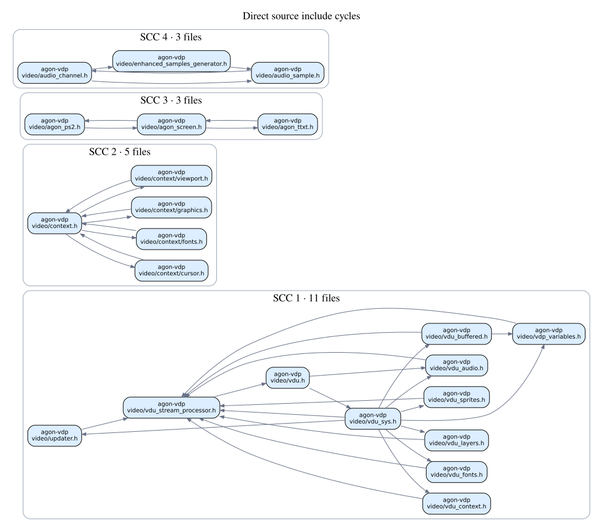
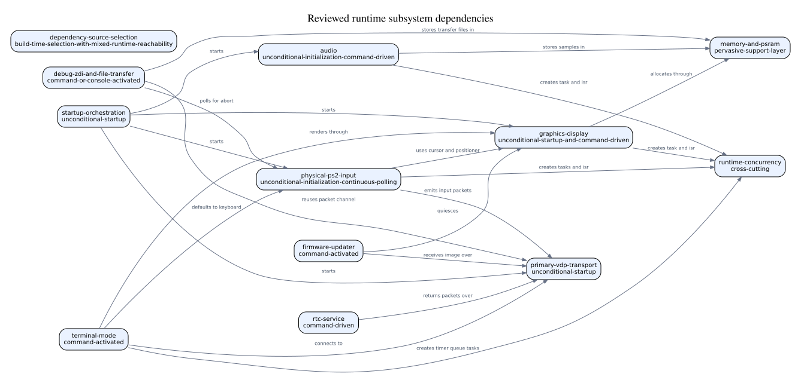
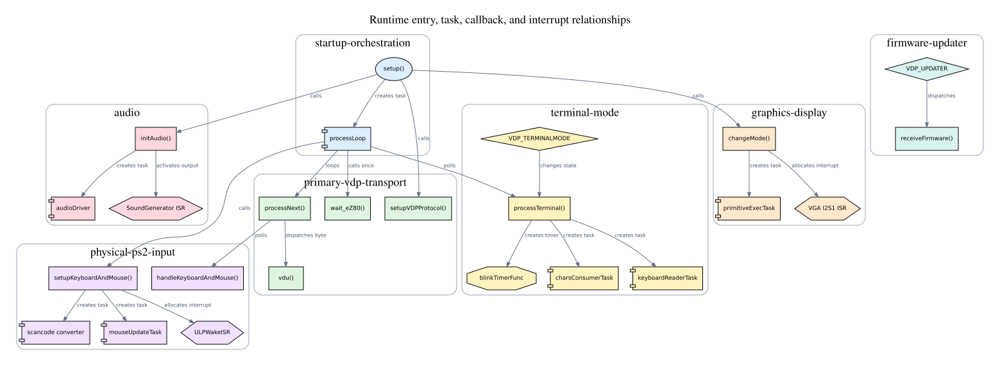

# SETUP-003 Work 7 — Dependency views

## Scope

This review summarizes dependency relationships in official Agon VDP
`v2.16.0` and its selected dependencies. The machine-readable authority is
[`generated/dependency-views.yaml`](generated/dependency-views.yaml). It
contains the complete resolved direct-source include graph, ranked fan-in and
fan-out, strongly connected components, and the reviewed subsystem and runtime
entry graphs. Graphviz files are derived navigation aids, not graph inputs.

## Source include graph

The extractor processed 864 direct include records from 176 indexed project
and dependency source files. It resolved 411 distinct internal file-to-file
edges. The remaining 453 records name framework, SDK, C/C++ library, or
otherwise non-indexed targets; they remain counted by owner and target in the
machine output.

The highest distinct-file fan-in points are:

| File | Fan-in |
|---|---:|
| `vdp-gl/src/fabutils.h` | 40 |
| `vdp-gl/src/fabglconf.h` | 24 |
| `agon-vdp/video/agon.h` | 20 |
| `vdp-gl/src/devdrivers/swgenerator.h` | 19 |
| `agon-vdp/video/types.h` | 17 |
| `vdp-gl/src/fabgl.h` | 17 |
| `vdp-gl/src/displaycontroller.h` | 14 |
| `agon-vdp/video/vdu_stream_processor.h` | 10 |

The highest distinct-file fan-out points are:

| File | Fan-out |
|---|---:|
| `vdp-gl/src/fabfonts.h` | 41 |
| `vdp-gl/src/fabgl.h` | 19 |
| `agon-vdp/video/vdu_sys.h` | 14 |
| `agon-vdp/video/vdu_buffered.h` | 13 |
| `agon-vdp/video/video.ino` | 12 |
| `agon-vdp/video/context/graphics.h` | 10 |
| `agon-vdp/video/vdu_audio.h` | 10 |
| `agon-vdp/video/vdu_stream_processor.h` | 9 |

These rankings count distinct internal target or source files, not repeated
include directives. They show that aggregation and shared implementation
headers dominate the direct-source graph.

## Strongly connected include groups

Four nontrivial strongly connected components occur in the direct-source
graph:

1. An 11-file VDU group centered on `vdu_stream_processor.h` and `vdu_sys.h`,
   also containing updater, variable, context, buffered-command, audio, font,
   layer, and sprite headers.
2. A five-file context group containing `context.h` and the cursor, font,
   graphics, and viewport context headers.
3. A three-file PS/2, screen, and teletext group.
4. A three-file audio-channel, audio-sample, and enhanced-sample-generator
   group.

The exact members and internal edges are recorded in the YAML. The compact
cycle view shows only edges internal to each component; cross-component and
acyclic edges remain available in the complete machine graph.

## Reviewed semantic views

Mechanical includes do not establish runtime activation. Subsystem and runtime
edges therefore come from the bounded, source-cited model in
[`evidence/work-7-graph-model.yaml`](evidence/work-7-graph-model.yaml). The
generator rejects unknown node IDs, mismatched upstream source identities, and
source references outside indexed file extents before rendering the model.

The subsystem view contains 12 reviewed Work 6 subsystem nodes and 21 direct
dependency or activation relationships.

The runtime view contains 24 entry, function, handler, task, interrupt,
command, and timer-callback nodes connected by 22 reviewed relationships. It
is a bounded lifecycle map, not an exhaustive call graph.

## Compiler-evidence boundary

Work 4 records a 621-file compiler dependency closure. Its direct include-tree
trace terminates at the recorded missing `soc/frc_timer_reg.h` header and is
therefore incomplete. Work 7 uses the complete Work 6 source-level include
records for direct project/dependency edges and retains the compiler closure
only as transitive build context. It does not present the partial compiler tree
as a complete direct include graph.
