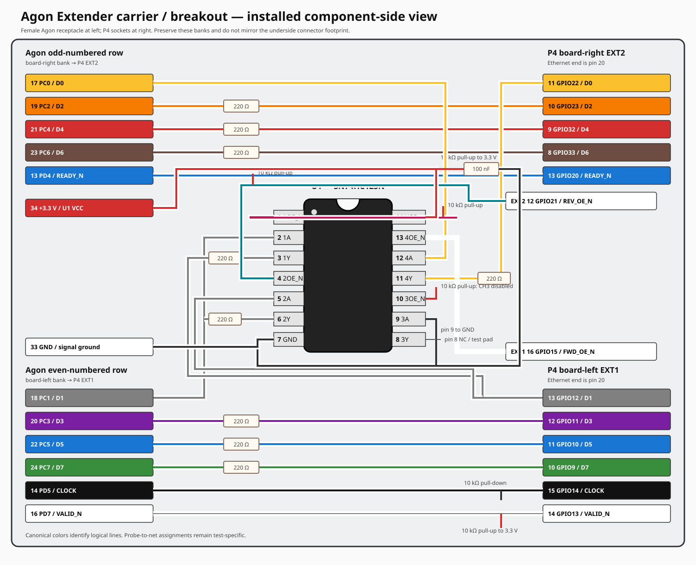

# Agon Extender carrier-breakout design basis

This document is the current carrier wiring and layout specification. It is
written as a purpose-built breakout PCB specification and applies directly to
the first soldered perfboard implementation. It remains authoritative until a
physical result or an explicit design decision changes it. The canonical
forward electrical map remains
[`wiring-diagram.svg`](wiring-diagram.svg), and design decisions remain in
[`../DECISIONS.md`](../DECISIONS.md).



The drawing is intentionally simplified to the selected Agon and P4 pins. Its
colors, header labels, and installed left/right orientation match the canonical
main wiring diagram. It also shows the complete on-hand `SN74HC125N` DIP-14
pinout with pin 1 at the upper left and the package notch at the top.

## Intended assembly

The carrier plugs directly into the Agon Light 2 expansion header through one
Samtec `SSW-117-02-T-D-RA` 34-position, 2 x 17, 2.54 mm right-angle female
receptacle. The female openings face horizontally toward the Agon. The bent
2.54 mm solder tails point upward through the carrier from its underside, so
the carrier sits above the connector body and retains useful clearance beneath
the board.

The ESP32-P4-DevKit Rev D1 mounts on removable female headers on the component
side of the carrier. Do not solder the DevKit directly. Keep its USB, Ethernet,
reset, boot, and debug connections accessible with the carrier installed.

The first physical build must dry-fit the Samtec connector, actual perfboard or
PCB thickness, Agon enclosure clearance, and P4 header height before soldering.
The specified connector tail is only 2.54 mm long; a nominal 1.6 mm board leaves
little protruding tail. A fabricated PCB should use ordinary plated holes and
avoid unnecessarily thick stock at this connector.

## Orientation authority

All placement and routing descriptions use the **installed component-side
view**: the carrier is installed on the Agon, and the observer looks down on
the carrier and P4. Do not mirror a footprint merely because the connector is
mounted beneath the carrier. Verify pin 1 by continuity on the first bare board.

The current breadboard geometry is deliberate and must survive translation to
a carrier:

- the Agon **odd-numbered row** is the board-right signal bank and routes toward
  the P4's **board-right EXT2** header;
- the Agon **even-numbered row** is the board-left signal bank and routes toward
  the P4's **board-left EXT1** header;
- the P4 remains in the same left/right orientation shown in
  `wiring-diagram.svg`; and
- P4 header pin order runs from pin 20 at the Ethernet end toward pin 1 at the
  USB end.

Place the Agon receptacle and P4 sockets so these two routing banks naturally
fan outward toward their respective P4 sides. Do not swap the P4 sockets,
rotate the module 180 degrees for visual convenience, or cross the odd and even
banks in copper. If a mechanical constraint appears to require that, stop and
change the board outline or connector placement first.

The preferred board zoning is:

```text
                  installed component-side view

          Agon odd row              Agon even row
               |                         |
        odd/control bank          even/control bank
               |                         |
        P4 board-right EXT2       P4 board-left EXT1

                 [ ESP32-P4-DevKit ]
```

This is a connectivity/orientation diagram, not a claim that the two rows are
physically separate connectors. They are the two rows of the single 2 x 17
Agon receptacle.

## Current forward-bus pin map

These routes reproduce the proved breadboard circuit. Signals are grouped by
the side on which they should remain during placement and routing.

| Bank | Agon header | Agon signal | Carrier function | P4 header | P4 GPIO |
|---|---:|---|---|---|---:|
| Odd / EXT2 | 17 | `PC0` | `D0` | EXT2 pin 11 | 22 |
| Even / EXT1 | 18 | `PC1` | `D1` | EXT1 pin 13 | 12 |
| Odd / EXT2 | 19 | `PC2` | `D2` | EXT2 pin 10 | 23 |
| Even / EXT1 | 20 | `PC3` | `D3` | EXT1 pin 12 | 11 |
| Odd / EXT2 | 21 | `PC4` | `D4` | EXT2 pin 9 | 32 |
| Even / EXT1 | 22 | `PC5` | `D5` | EXT1 pin 11 | 10 |
| Odd / EXT2 | 23 | `PC6` | `D6` | EXT2 pin 8 | 33 |
| Even / EXT1 | 24 | `PC7` | `D7` | EXT1 pin 10 | 9 |
| Odd / EXT2 | 13 | `PD4` | `READY_N` | EXT2 pin 13 | 20 |
| Even / EXT1 | 14 | `PD5` | `CLOCK` | EXT1 pin 15 | 14 |
| Even / EXT1 | 16 | `PD7` | `VALID_N` | EXT1 pin 14 | 13 |

Agon pin 33 supplies the current circuit ground connection and pin 34 supplies
the current 3.3 V reference. P4 EXT1 pin 2 is the proved P4 ground connection.
Power entry and back-power prevention are not yet production decisions; expose
these nets and do not silently join P4 USB-derived rails to Agon power.

## Routing rules

1. Route each bank from its Agon row toward the matching P4 side. Prefer short,
   monotonic traces; a via is better than weaving an entire bank through the
   other bank.
2. Keep `D0..D7` ordered physically. Do not permute data bits to make layout
   easier: the current straight-across mapping was selected specifically to
   make assembly and visual inspection sane.
3. Put the eight data-series elements in one obvious row between the Agon
   connector and P4 sockets. Populate the proved 220 ohm value initially.
   Footprints may accept loose axial resistors or isolated networks, but their
   channel numbering must remain visible.
4. Keep `CLOCK` beside its return path and away from connector edges or long
   parallel runs that invite coupling. Preserve the proved 10 kohm pull-down.
5. Preserve 10 kohm pull-ups on `READY_N` and `VALID_N`. `READY_N` remains the
   P4 open-drain admission signal; do not route it through a push-pull-only
   shortcut.
6. Place 100 nF bypass capacitors immediately beside every carrier buffer IC.
   Provide a nearby bulk-capacitor footprint without making its value part of
   the signal contract.
7. Use continuous ground copper where practical. Provide several ground test
   points near the Agon connector, P4 headers, control signals, and logic
   analyzer landing area.
8. Label both board faces with connector names, pin 1, signal names, voltage,
   and direction. Labels must be readable in the installed orientation.

## U1 forward isolation and reverse-UART circuit

U1 is one quad non-inverting three-state buffer. Populate the on-hand
`SN74HC125N` for the controlled bench build. The pin-compatible bought
`SN74LV125AN` is the intended replacement where either-order power and powered-
off isolation are required; do not infer that the HC part has `Ioff` behavior.

`PC0/GPIO22` always travels Agon to P4: it is `D0` during parallel records and
eZ80 UART TX during a forward UART epoch. `PC1/GPIO12` changes direction: it is
`D1` from Agon to P4 during parallel records and P4 UART TX to eZ80 UART RX
during a reverse epoch. The direct PC0 and PC1 jumpers are therefore removed
and U1 is wired exactly as follows:

| U1 pin | U1 name | Connection |
|---:|---|---|
| 1 | `1OE_N` | `FWD_OE_N`; P4 GPIO15, EXT1 pin 16; 10 kohm pull-up |
| 2 | `1A` | Agon pin 18, `PC1` |
| 3 | `1Y` | through 220 ohm to P4 GPIO12, EXT1 pin 13 |
| 4 | `2OE_N` | `REV_OE_N`; P4 GPIO21, EXT2 pin 12; 10 kohm pull-up |
| 5 | `2A` | P4 GPIO12, EXT1 pin 13 |
| 6 | `2Y` | through 220 ohm to Agon pin 18, `PC1` |
| 7 | `GND` | common signal ground |
| 8 | `3Y` | no connection; provide a labeled test pad only |
| 9 | `3A` | ground |
| 10 | `3OE_N` | 10 kohm pull-up; channel permanently disabled |
| 11 | `4Y` | through 220 ohm to P4 GPIO22, EXT2 pin 11 |
| 12 | `4A` | Agon pin 17, `PC0` |
| 13 | `4OE_N` | `FWD_OE_N`; same net as U1 pin 1 |
| 14 | `VCC` | Agon 3.3 V; 100 nF directly to pin 7 |

The 220-ohm elements on U1 pins 3, 6, and 11 are separate resistors. Do not try
to share the PC1 resistor between the opposed drivers. `D2..D7` retain their
existing individual 220-ohm series resistors.

GPIO15 and GPIO21 are selected because they are currently unused header pins
on the same physical sides as the nets they control. Both enable pulls are
powered from U1's 3.3 V rail, so U1 defaults to high impedance. Firmware may
drive an enable Low only after configuring both enable GPIOs released High.

Every output-enable net must have a hardware default that disables its driver
during reset, programming, disconnected control, and early boot. Firmware
break-before-make is an additional guarantee, not the only guarantee. Series
resistance can limit accidental contention current but is not isolation.

### Required ownership states

| State | `FWD_OE_N` | `REV_OE_N` | PC0 path | PC1 path |
|---|---:|---:|---|---|
| Reset, boot, fault, turnaround | High | High | disabled | both directions disabled |
| Parallel forward record | Low | High | Agon to P4 | Agon to P4 |
| UART response, Agon to P4 | Low | High | Agon TX to P4 RX | Agon RX path remains forward-buffered but carries idle/input state |
| UART command, P4 to Agon | High | Low | disabled | P4 TX to Agon RX |

The transition sequence is always disable the active enable, wait the measured
break-before-make interval, reconfigure endpoint pin mux/directions, then enable
the destination direction. Both enables Low simultaneously is forbidden.

The HC125 bench build requires the established development power discipline:
power the Agon before the P4 and hard-reset the P4 after both rails are stable.
Do not use it to claim either-order power safety. Replace U1 with the LV125 and
qualify the complete power matrix before production.

## Power and reset provisions

Provide distinct, plainly labeled nets and test points for:

- Agon ground and 3.3 V reference;
- P4 ground;
- any carrier logic supply;
- P4 USB-derived power; and
- optional downstream-module power.

Only grounds required by the selected interface are unconditionally common.
Do not connect power outputs from two independently powered boards. Leave room
for the later production power/isolation solution and for reset-safe discharge
or sequencing parts.

Bring P4 reset, Agon reset-actuator control, and all driver enables to labeled
test pads or headers. The existing development workaround requiring a P4 hard
reset after a power cycle remains non-gating for development but must remain
visible rather than being hidden by the carrier.

## Debug and expansion provisions

Provide accessible pads for `D0..D7`, `CLOCK`, `VALID_N`, `READY_N`, every
buffer enable, 3.3 V, and ground. These are signal pads, not permanent sniffer
wire assignments: only analyzer channel colors are canonical, and probe-to-net
assignments belong to individual test procedures.

Leave unused P4 pins uncommitted unless a decision assigns them. A small
unpopulated expansion header is preferable to speculative routing. In
particular, preserve access to P4 USB Serial/JTAG and Ethernet; both are active
development and product facilities, not expendable connector real estate.

## First-board inspection gates

Before installing either processor board:

- visually confirm installed-view pin 1 on all three connector footprints;
- meter every Agon pin to its intended P4 or conditioning endpoint;
- prove no adjacent shorts and no connection between independent power rails;
- verify all driver enables default inactive with controllers absent;
- verify pull directions and values; and
- verify the carrier does not mechanically obstruct Agon, P4, Ethernet, USB,
  reset, boot, SD-card, or enclosure access.

Then power the carrier without the P4, measure every exposed rail and signal,
install the P4 with all configurable drivers disabled, and repeat the existing
forward-path qualification before enabling any reverse circuit.

## What this board is not yet

This specification does not yet select connector keying, the final ESD network,
power-source policy, downstream Pico/display population, or final outline. It
does specify the present bench carrier wiring, orientation, buffer pinout, and
reverse-UART ownership states. Any change to those items must update this
document and the drawing together before the physical build changes.
