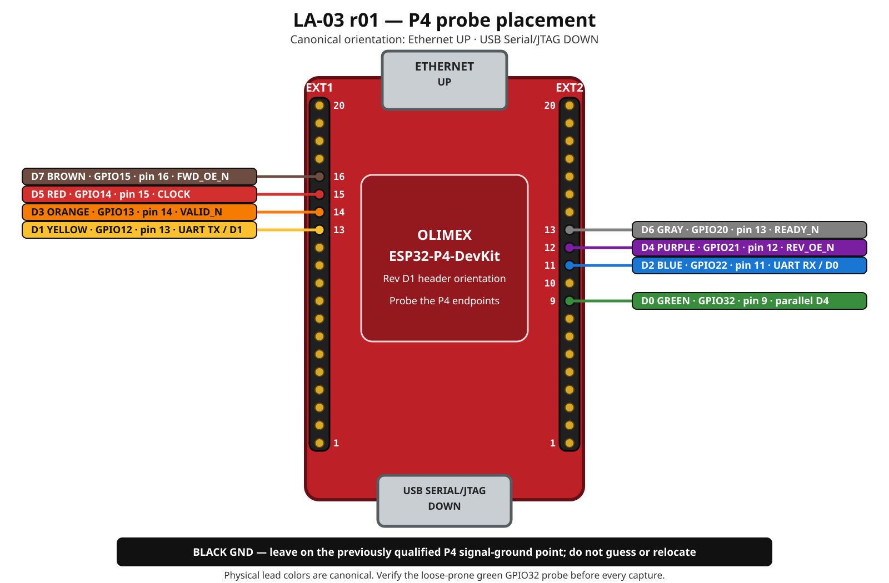

# LA-03 P4 probe fixture r01

`la03-p4-probe-fixture-r01` is the tracked first target for the existing
eight-channel USB logic analyzer and its LA-03 attachments at the P4 headers.
It is separate from [`light2-harness-r01`](../../designs/light2-harness-r01/README.md):
the harness defines product circuitry, while this fixture defines removable
measurement probes.

The normative machine-readable definition is [`profile.yaml`](profile.yaml).
In conflicts, authority order is:

1. `profile.yaml`;
2. this README; and
3. preserved files under `legacy-evidence/`.

## Stable analyzer harness

| Channel | Lead color |
|---|---|
| `D0` | green |
| `D1` | yellow |
| `D2` | blue |
| `D3` | orange |
| `D4` | purple |
| `D5` | red |
| `D6` | gray |
| `D7` | brown |
| `GND` | black, qualified analyzer ground position |

Even channels `D0,D2,D4,D6` form one ribbon and odd channels
`D1,D3,D5,D7` form the other. Display colors in PulseView are not probe-wire
identities. Every run must record channel, physical color, and measured
endpoint.

## Current LA-03 target

The figure uses the canonical Olimex orientation: Ethernet is up, USB
Serial/JTAG is down, EXT1 is on the board's left, and EXT2 is on its right.
Physical probe-wire colors are authoritative; PulseView display colors are not.

| Channel | Color | P4 endpoint | Net |
|---|---|---|---|
| `D0` | green | GPIO32 / EXT2 pin 9 | parallel `D4` |
| `D1` | yellow | GPIO12 / EXT1 pin 13 | UART TX / parallel `D1` |
| `D2` | blue | GPIO22 / EXT2 pin 11 | UART RX / parallel `D0` |
| `D3` | orange | GPIO13 / EXT1 pin 14 | `VALID_N` |
| `D4` | purple | GPIO21 / EXT2 pin 12 | `REV_OE_N` |
| `D5` | red | GPIO14 / EXT1 pin 15 | `CLOCK` |
| `D6` | gray | GPIO20 / EXT2 pin 13 | `READY_N` |
| `D7` | brown | GPIO15 / EXT1 pin 16 | `FWD_OE_N` |
| `GND` | black | qualified P4 ground | signal ground |

The predecessor LA-03 procedure says the green D0 probe is on “GPIO32 / EXT2
pin 10.” Those identifiers cannot both be true: the authoritative Rev D1
pinout maps GPIO32 to EXT2 pin 9 and GPIO23 to EXT2 pin 10. The source is
preserved as legacy evidence, but the initial r01 import deliberately assigned
neither endpoint until physical inspection. On 2026-08-22 the Author inspected
the live bench and verified that green D0 is attached to P4 GPIO32. The
authoritative Rev D1 pinout resolves that endpoint to EXT2 pin 9. Because this
probe is known to loosen, every capture must still verify that attachment
before relying on its evidence.

The latest predecessor reset run recorded only the channels it analyzed:
purple D4 on `REV_OE_N`, brown D7 on `FWD_OE_N`, and qualified black ground.
Its procedure says the underlying LA-03 fixture remained unchanged, so that
run is evidence for those three attachments but not independent proof of the
other five.

## Change and run control

Before any capture, visually verify every probe used by the procedure and
record a test-local probe map. A loose or moved probe does not silently change
this fixture; it makes the physical setup nonconforming until corrected or a
new fixture revision is approved. Never move probes while the bench is
powered.
